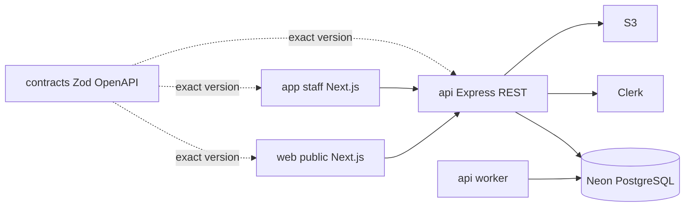

# Drezivo Architecture

The API is the authority for authorization, tenant scope, money, availability, and state
transitions. The browser is a client, never a trust boundary. The [TRD](../../Drezivo-TRD.md)
and [data model](../../Drezivo-Data-Model.md) contain the complete technical contract.
