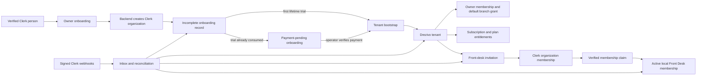

# Tenancy, Onboarding, Clerk, Memberships, and Billing Foundation

## Purpose and authority

This note records the accepted V1 foundation for business-owner access. It defines how a
person, Clerk organization, Drezivo tenant, subscription, and Front Desk membership come into
existence, and what happens when any of them fails or changes.

It is an implementation map, not a replacement for canonical specifications. The
[PRD](../../docs/product/Drezivo-PRD.md), [TRD](../../docs/architecture/Drezivo-TRD.md),
[Data Model](../../docs/architecture/Drezivo-Data-Model.md), and
[ERD](../../docs/architecture/Drezivo-ERD.dbml) remain authoritative. The first implementation
slice must align them with this decision before code changes behavior.

This vault contains no credentials, customer records, payment evidence, or production identifiers.

## Decided boundaries

| Concern                     | Decision                                                                                                                                                                         |
| --------------------------- | -------------------------------------------------------------------------------------------------------------------------------------------------------------------------------- |
| Identity                    | Clerk authenticates a person and maintains organization membership. It does not grant Drezivo permissions.                                                                       |
| Local authorization         | The API resolves current local membership, branch grants, tenant state, and entitlements on every protected request.                                                             |
| Owner model                 | A verified person may own one Drezivo business and may be Front Desk in other businesses.                                                                                        |
| Staff model                 | Front Desk access is invitation-only. An invitation recipient may sign up through Clerk, but that account does not create a tenant.                                              |
| Owner onboarding            | A public verified signup is an owner candidate and must enter owner onboarding. It creates, never selects, an organization.                                                      |
| Clerk organization creation | The Drezivo backend creates the Clerk organization. The client receives the result and sets that organization active in Clerk.                                                   |
| Incomplete work             | Exactly one unfinished onboarding is allowed per owner. It can be resumed or abandoned. Abandonment archives Drezivo state but retains the Clerk organization and audit history. |
| Existing businesses         | The app switches only among provisioned Drezivo businesses where the actor has an active local membership.                                                                       |
| Trial                       | A verified person receives one seven-day lifetime trial. The selected plan's real limits apply immediately.                                                                      |
| Later business              | After a trial is used, a replacement business is payment-pending. No tenant exists until a platform operator verifies payment.                                                   |
| Closure                     | Operator-assisted permanent closure releases the one-owned-business slot. The former owner retains a limited read-only settlement and export view.                               |
| Billing V1                  | Billing is manual and audited. V1 has no card collection, stored card, recurring charge, or payment gateway.                                                                     |
| Membership source           | Drezivo creates and revokes Clerk memberships through an outbox-backed integration. Webhooks reconcile, never independently grant local access.                                  |
| Provider loss               | External Clerk-organization deletion immediately restricts the linked tenant. Data is retained; recovery requires an operator.                                                   |

## Terms

- **Account:** a minimal internal principal keyed by Clerk user ID. It is not a profile mirror and
  stores no display name or email.
- **Organization onboarding:** the pre-tenant record for one owner-created Clerk organization. It
  makes interrupted setup resumable without beginning a trial prematurely.
- **Tenant:** Drezivo's internal business isolation boundary, created only by successful bootstrap
  or verified paid activation.
- **Membership:** a tenant-local authorization record that maps a Clerk user ID to Owner or Front
  Desk.
- **Invitation:** the Drezivo-controlled pending request to add Front Desk. It reserves a seat
  until expiry, cancellation, or acceptance.
- **Active physical asset:** an individually tracked garment active for operations, not a style,
  product, or variant.
- **Platform operator:** Drezivo personnel in a separate audited allowlist keyed by Clerk user ID.
  An operator is not a tenant member by default.

## System relationship

The browser never declares a tenant, role, plan, seat count, entitlement, or webhook outcome.
Every transition is a validated API command backed by database state.

## Owner lifecycle

### Public signup and mandatory routing

1. A person signs up and verifies email with Clerk.
2. If the request is an invitation acceptance, the app continues the invitation flow. It does not
   redirect the recipient into owner onboarding.
3. Otherwise the app creates or resolves the minimal local account and routes the person to
   mandatory owner onboarding. A user cannot enter a normal staff workspace without a valid
   Drezivo membership.
4. An account may be Front Desk in another tenant. That does not prevent its one owned-business
   journey.

"Every account is an owner" means every normal public signup is an owner candidate. It does not
mean a Clerk identity automatically becomes an Owner membership, or that an invitee becomes owner.

### Create-only organization onboarding

The client submits an organization/business display name and, optionally, a validated lowercase
slug to a Drezivo onboarding command. The API:

1. verifies the Clerk user and locks that account's onboarding state;
2. rejects a second `incomplete` or `payment_pending` onboarding;
3. rejects a new onboarding while the account owns a current tenant;
4. creates the Clerk organization with the authenticated person as creator and administrator;
5. writes an `organization_onboarding` record containing the Clerk organization correlation,
   display name, and requested slug; and
6. returns a safe projection so the client can activate the new Clerk organization and resume
   setup. Provider identifiers remain outside the public projection.

Owner name, contact email, business type, branch address, hours, payment instructions, policies,
and the first asset are collected during tenant bootstrap and setup. They are not copied from
Clerk profile fields into the pre-tenant account record.

The provider call and database transaction are not one distributed transaction. The command first
claims an account-scoped `Idempotency-Key`, serializes concurrent owner starts, and records a
recoverable external-operation state, preventing a second Clerk organization on retry. If the
browser disconnects after Clerk succeeds but before the local write, the signed
`organization.created` webhook repairs the missing incomplete record. A webhook is a recovery
path, not the authoritative start of onboarding.

The HTTP commands are `POST /api/v1/onboarding`, `GET /api/v1/onboarding/current`, and
`POST /api/v1/onboarding/:onboardingId/abandon`. Create is limited to five requests per minute
per verified user, reads to thirty, abandonment to ten, and owner JSON bodies to 16 KiB. Incomplete
onboarding remains until the owner explicitly abandons it. Invitation recipients use the later
verified invitation-claim flow instead of this owner-create command.

The app never offers an arbitrary Clerk organization picker during onboarding. Organization
switching comes later and lists only businesses with active local membership.

### Resume, abandon, and payment-pending

An incomplete onboarding has one owner and one Clerk organization. Its owner may return, choose a
plan, edit allowed pre-bootstrap inputs, and complete it.

Explicit abandonment:

- changes local status to `abandoned`;
- records actor, time, and a reason category in audit history;
- removes it from the normal Drezivo onboarding UI;
- retains the Clerk organization and local history; and
- permits one replacement incomplete onboarding.

Drezivo never deletes a Clerk organization from this action. An unprovisioned organization cannot
become a tenant merely because it is selected in Clerk.

If the person has already used a lifetime trial, plan choice changes the record to
`payment_pending`. It remains pre-tenant. It creates no branch, storefront, subscription, or
operational capacity. Only verified operator payment can create the replacement tenant.

### Tenant bootstrap

For a trial-eligible owner, plan selection and completion run one idempotent transaction:

1. lock the account and onboarding record;
2. verify no trial is consumed and no current owned tenant exists;
3. create the tenant linked to the Clerk organization;
4. create default branch, Owner membership, and Owner branch grant;
5. create draft storefront and required initial settings placeholders;
6. create selected-plan subscription in `trialing`;
7. set `trial_ends_at` from database time plus seven calendar days;
8. append immutable `trial_started` event;
9. mark account trial consumed and onboarding provisioned; and
10. write audit and outbox records inside the same transaction.

Duplicate requests return the original result. Concurrent requests create at most one tenant,
membership, subscription, and trial. The first business needs no card or payment account.

### One owned business and closure

The minimal account record stores the current owned-tenant link separately from historical
membership. A serialized account-level check enforces one current owned tenant even when the
person is Front Desk elsewhere.

An owner cannot self-close into a replacement business. An operator permanently closes the current
tenant with an audited reason. Closure changes the tenant to its persisted `cancelled` state, disables
new operations and invitations, preserves records and settlement obligations, retains specific
read-only settlement/export access, then releases the account's current-owned-tenant link. A later
business never receives another trial.

## Membership and invitation lifecycle

### Roles and access

V1 has exactly two tenant roles:

| Area                                       | Owner                | Front Desk                                                   |
| ------------------------------------------ | -------------------- | ------------------------------------------------------------ |
| Assets, conditions, and blocks             | Full                 | Operational edits, no archive                                |
| Reservations, pickup, return, and cleaning | Full                 | Create, update, custody                                      |
| Payment instructions and refunds           | Full                 | View only, no edit or refund                                 |
| Evidence                                   | View, verify, reject | Operational view, no verification by default                 |
| Private documents                          | Audited full         | Assigned receipts only; identity documents denied by default |
| Policies, publishing, and users            | Full                 | Read-only                                                    |
| Exports and deletion                       | Full audited         | Request only                                                 |

The API derives permission from local role and branch grant. Clerk roles or claims are never a
substitute for current Drezivo authorization.

A tenant must always retain at least one active Owner. The final active Owner cannot self-remove,
be removed, or be demoted. An approved ownership transfer atomically validates and installs the
successor before the prior Owner loses the role.

### Invitation issuance

Only a current Owner may invite Front Desk. The command:

1. resolves the caller's active tenant and Owner membership;
2. obtains subscription and entitlements under a tenant lock;
3. counts active Front Desk memberships plus unexpired pending invitations;
4. rejects an invite that exceeds the plan seat cap;
5. creates a seven-day Drezivo invitation with stable business key;
6. writes a Clerk invitation outbox event in the same transaction; and
7. returns safe invitation status, never provider secrets or raw tokens.

The email is retained only because it is needed to send and correlate the invitation. It is
normalized, access-controlled, omitted from logs, and not the post-acceptance identity key. The
role is always Front Desk in V1.

Resend, cancellation, and expiry are idempotent transitions. Resend replaces the provider
invitation through the outbox without consuming a second seat. Expired and cancelled invitations
release their seat.

### Acceptance and access removal

After Clerk accepts an invitation, the app calls a Drezivo claim command. The API verifies the
current Clerk user and active organization, accepted Clerk organization membership, local unexpired
invitation correlation, intended tenant, role, and seat entitlement under a tenant lock. It then
activates or restores exactly one local Front Desk membership and default branch grant.

The claim is safe to repeat. Webhooks reconcile delayed claim calls and retries. An uncorrelated
provider-created membership is never locally activated.

When an Owner removes Front Desk, Drezivo marks the local membership removed first and queues Clerk
removal through the outbox. The next protected request fails locally even if a Clerk session remains.
History is not deleted.

Sole-owner replacement is not self-service. It needs operator assistance, verified business-contact
evidence, a reason-coded audit record, and a second internal approval before local and Clerk changes.

## Plans, entitlement, and billing lifecycle

### V1 plan limits

| Plan         | Monthly price | Active physical assets | Front Desk seats |
| ------------ | ------------: | ---------------------: | ---------------: |
| Starter      |       PHP 300 |                     75 |                1 |
| Professional |       PHP 499 |                    250 |                3 |
| Business     |     PHP 1,299 |                  1,000 |               10 |

Prices are PHP minor units 30000, 49900, and 129900. Entitlements are versioned with the plan, not
copied as mutable browser configuration.

Asset quota counts active physical assets only. Styles, variants, drafts, and archived assets are
not quota units. Creation, activation, and CSV import commit check the limit under a tenant lock.
Preview can show validation, but a commit above cap rejects with no partial write. Drezivo does not
silently archive, deactivate, or delete overage assets.

Seat quota counts active Front Desk memberships plus unexpired pending invitations. The Owner does
not consume a Front Desk seat.

### Trial, plan changes, and downgrade

- The first trial is seven days from database time and applies the selected plan immediately.
- The owner may change plan during trial. The new entitlement set is checked and applied
  immediately, with an immutable plan-change event.
- A downgrade is rejected when active assets or counted seats exceed the new plan. Nothing is
  automatically suspended or deactivated.
- Trial expiry transitions `trialing` to `past_due`, sets a seven-day `grace_ends_at`, and keeps
  normal operational access.
- Grace expiry transitions subscription and tenant to `restricted` unless verified payment has
  started a paid period.

Request-time checks are authoritative. A durable expiry worker performs the same transitions for
prompt convergence, but a late worker can never create extra access.

### Restricted and cancelled behavior

`cancelled` is the persisted tenant status; “closed” is only the product description of the
business outcome.

| Capability                                      | Active, trialing, or past-due grace | Restricted | Cancelled                        |
| ----------------------------------------------- | ----------------------------------- | ---------- | -------------------------------- |
| Existing-rental reads, returns, refunds, export | Allowed                             | Allowed    | Read-only settlement/export only |
| New bookings, holds, or public intake           | Allowed                             | Denied     | Denied                           |
| Publish or materially change storefront         | Allowed                             | Denied     | Denied                           |
| New assets or activation                        | Allowed within quota                | Denied     | Denied                           |
| Staff invitations or membership changes         | Allowed within quota                | Denied     | Denied                           |

### Manual operator payment

Platform operators are a local Clerk-ID allowlist using separate routes. Their actions require a
reason, stable business key, immutable audit event, and fresh authorization.

For an existing tenant, verified payment records immutable subscription payment/event, activates the
chosen plan, and starts the paid month at database time. For payment-pending onboarding, no tenant
exists yet. The system records pre-provision payment verification globally, then an idempotent
activation creates tenant, subscription, paid-period event, and linked subscription payment. This
prevents an externally received payment from appearing rolled back when tenant creation must retry.

V1 has no automated collection, stored payment credential, payment-gateway webhook, or recurring
charge.

## Webhook, outbox, and recovery design

Clerk webhooks are asynchronous and retried. The existing global inbox verifies, deduplicates, and
persists each provider event before processing.

The webhook route is registered before JSON parsing and verifies exact raw bytes. It applies a
small raw-body bound and route-specific rate limits before durable processing, uses Clerk's
supported Express verification path and a unique provider event ID, and returns generic failures
that disclose neither verification nor reconciliation state. It never parses, logs, or reserializes
the body before verification.

The v1 event allowlist contains only organization, organization-invitation, and
organization-membership events. User-profile events are rejected or ignored; Drezivo does not
mirror Clerk user profile fields.

| Event family                             | Required local effect                                                                                                   |
| ---------------------------------------- | ----------------------------------------------------------------------------------------------------------------------- |
| Organization created                     | Reconcile a missing incomplete record only when creator and server operation correlate. Never provision or start trial. |
| Organization updated                     | Reconcile safe provider metadata only. Business settings remain Drezivo-owned.                                          |
| Organization deleted                     | Restrict tenant, disable ordinary staff/public intake, retain records, and create operator recovery work.               |
| Invitation created, revoked, or accepted | Reconcile local invitation and outbox state. Unknown events do not reserve a seat or grant access.                      |
| Membership created or updated            | Reconcile correlated Owner/Front Desk membership. Unknown additions fail closed and require review or reversal.         |
| Membership deleted                       | Remove or suspend local access without deleting history.                                                                |

Every Clerk-changing command writes an outbox event in the same transaction as its local state
change. The worker leases work, retries with a bound, and exposes terminal failure. The webhook
inbox and outbox together tolerate duplicate delivery, delayed delivery, provider failure, browser
retry, and worker restart.

Clerk references consulted 2026-09-16:
[Organizations](https://clerk.com/docs/guides/organizations/overview) and
[Webhooks](https://clerk.com/docs/guides/development/webhooks/overview).

## Storage and database invariants

| Record                          | Scope                             | Required invariant                                                                                                |
| ------------------------------- | --------------------------------- | ----------------------------------------------------------------------------------------------------------------- |
| Account                         | Global                            | Clerk user ID unique; minimal lifecycle/trial state only; no profile mirror.                                      |
| Organization onboarding         | Global pre-tenant                 | Clerk org ID unique; one unfinished record per creator; audited transition history and tenant link.               |
| Onboarding payment verification | Global pre-tenant                 | Stable business key; immutable verified operator record; linked to tenant only after success.                     |
| Tenant                          | Global root                       | Clerk org ID unique; active, restricted, or cancelled; retained after provider loss.                              |
| Membership                      | Tenant-owned                      | One Clerk user per tenant; Owner or Front Desk; removal preserves history.                                        |
| Membership invitation           | Tenant-owned                      | Stable intent per reserved seat; seven-day expiry; provider correlation; no raw provider token in ordinary reads. |
| Plan and entitlement            | Global                            | Versioned prices/limits; 75/250/1000 asset and 1/3/10 seat limits explicit.                                       |
| Subscription and events         | Tenant-owned                      | One current subscription; immutable history; database-time transitions.                                           |
| Webhook inbox                   | Global                            | Provider/event identity unique before tenant resolution; verified raw payload handling.                           |
| Outbox event                    | Tenant-owned or explicitly global | Stable dedupe key, lease, bounded retry, terminal failure visibility.                                             |

Tenant-owned rows retain explicit scope, same-tenant foreign keys, and row-level security.
Pre-tenant records never appear in tenant listing routes and are filtered by verified creator or
operator identity, failing closed on ambiguity.

## Contract boundary

The contracts workspace defines schemas, enums, error codes, and OpenAPI before API
implementation. Intended command groups are:

| Command group            | Actor                  | Purpose                                                                           |
| ------------------------ | ---------------------- | --------------------------------------------------------------------------------- |
| Owner onboarding         | Verified public user   | Create organization, resume/abandon setup, choose plan, complete bootstrap.       |
| Workspace context        | Active local member    | Read only provisioned organizations and local actor context.                      |
| Membership invitations   | Tenant Owner           | Create, resend, cancel, and list safe invitation state.                           |
| Membership claim         | Accepted Clerk invitee | Verify Clerk membership and activate one local Front Desk membership.             |
| Subscription plan change | Tenant Owner           | Change trial/active plan after entitlement checks.                                |
| Operator billing         | Platform operator      | Verify manual payment and activate subscription or payment-pending onboarding.    |
| Operator recovery        | Platform operator      | Restrict/recover provider loss, close tenant, or execute approved owner transfer. |
| Clerk webhook            | Clerk only             | Verify raw signed event, durable-dedupe, queue reconciliation.                    |

Tenant-owned requests derive tenant from verified active Clerk organization and local membership.
They never accept tenant ID, Clerk organization ID, role, seat count, entitlement, or plan price as
client authority.

## Security and operational requirements

- Every state-changing command has idempotency and sequential plus concurrent double-fire tests.
- Provider credentials are validated configuration, never contracts, logs, documentation, or
  browser data.
- Logs use opaque IDs, request ID, actor namespace, action, outcome, and UTC time. They omit raw
  webhook bodies, invitation tokens, email addresses, payment evidence, and Clerk tokens.
- Sensitive operator actions are reason-coded and append immutable audit events.
- Owner onboarding, invitation issuance, invitation claim, and webhook intake each have
  endpoint-specific request-size limits, rate limits, and generic anti-enumeration failures.
- Membership removal, provider loss, unknown webhook state, missing entitlement, and stale
  authorization deny access rather than guessing.
- Cached Clerk claims and frontend visibility are usability aids, not authorization.
- The worker has monitored terminal failures and an operator replay procedure for safe work.
- Launch documentation must cover Clerk webhook configuration/test replay, operator allowlist,
  manual-payment evidence, organization-loss recovery, and trial/grace monitoring.

## Implementation sequence and evidence

The staged work is tracked in the
[backend checklist](../../api/TENANCY-ONBOARDING-V1-CHECKLIST.md). It must not pull unrelated
product modules into scope.

1. Align canonical documents and add contracts.
2. Add global account/onboarding persistence and bootstrap idempotency.
3. Add Clerk adapter, raw webhook intake/reconciliation, and resumable create-only owner onboarding.
4. Add tenant bootstrap, Owner membership, trial subscription, and entitlement service.
5. Add invitation, verified claim, and local-first removal.
6. Add expiry worker, operator billing, closure, and owner-transfer recovery in bounded slices.
7. Build consumer flows only after their API slice and tests are stable.

The foundation is complete only when an owner can safely create, abandon/retry, and bootstrap once;
an invite reserves exactly one seat and yields one membership despite retries; one current owned
tenant and one lifetime trial are enforced; tenant/organization/revocation failures deny access;
and trial, grace, restriction, payment-pending, provider deletion, and duplicate delivery have
integration evidence.

## Decision history

### 2026-09-16

- Adopted backend-created, create-only Clerk organization onboarding.
- Adopted one incomplete onboarding and one current owned business per verified person.
- Adopted a seven-day per-person trial, then seven-day normal-access past-due grace, then
  restriction.
- Set physical-asset limits to 75 / 250 / 1,000 and Front Desk seats to 1 / 3 / 10.
- Chose manual operator-verified billing, no V1 payment gateway, and payment-pending replacement
  businesses.
- Chose immediate verified invitation claim with webhook reconciliation, seven-day invitation
  expiry, and local-first access removal.
- Chose immediate restriction on external Clerk organization deletion, operator-assisted closure,
  and second-approved sole-owner transfer.
- Phase 0 aligns the canonical specifications, closes the onboarding and webhook contract surface,
  and records the additive migration/RLS/backfill boundary before persistence work begins. Local
  compose provides loopback-only PostgreSQL and MinIO for migration rehearsal; it does not make
  object storage integration complete.

## Related notes

- [[00-Home/Drezivo Home]]
- [[02-Architecture/Drezivo Architecture]]
- [[03-Repositories/Repository Map]]
- [[04-Decisions/Decision Register]]
- [[05-Operations/Operating Model]]
- [[08-Daily/2026-09-16]]
