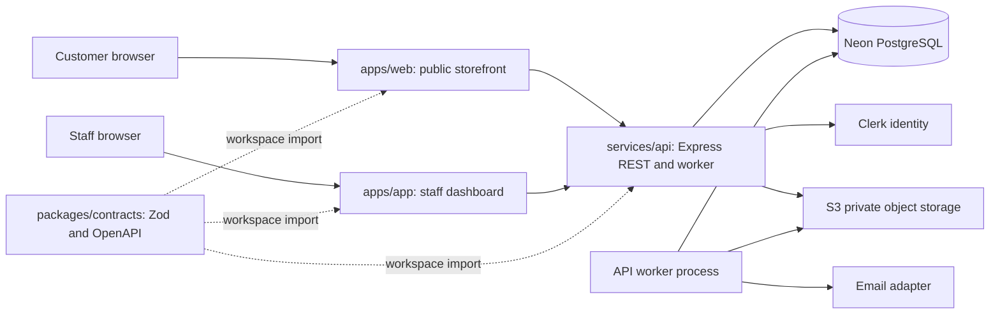
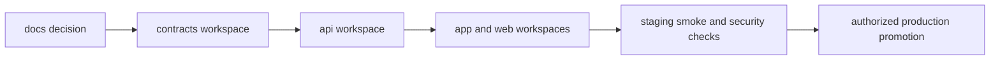

# Drezivo Root Repository Architecture

**Status:** canonical operating guide for the Drezivo monorepo
**Audience:** engineers, coding agents, reviewers, operators, and maintainers
**Updated:** 16 September 2026

This file is the root source of truth for the Drezivo workspace. Git is initialized at this root,
and the root `package.json` and `package-lock.json` govern all workspaces. The former `api`, `app`,
`contracts`, `docs`, and `web` checkouts are now packages and applications inside one repository.
Their local `.claude` and `.codex` folders remain as context during migration, but root rules win.

Read this file, [`AI-AGENT-ONBOARDING.md`](AI-AGENT-ONBOARDING.md), [`AGENTS.md`](AGENTS.md), and
[`SECURITY-FOUNDATION.md`](SECURITY-FOUNDATION.md) before editing. The companion
[human architecture guide](Drezivo-Human-Repository-Architecture-Guide.docx) explains the system
with visual examples. It is human onboarding material, not agent authority.

## Authority split

Agents follow this Markdown file, `AI-AGENT-ONBOARDING.md`, root `AGENTS.md`, root `.claude` rules,
and the relevant package rules. The DOCX is a separate human-readable manual. The current PRD, TRD,
data model, and accepted decisions define product intent. When explanatory prose conflicts with an
executable rule or an accepted decision, stop and record the discrepancy before implementation.

## System shape



The architecture is a modular monolith. One Express service owns business transactions and a
separately running worker consumes durable Postgres outbox jobs. Two Next.js applications render
public and staff surfaces. Neon PostgreSQL is the source of truth for tenant data, inventory,
availability, reservations, money, and workflow state. Clerk proves identity; the API resolves
membership, branch scope, permissions, and entitlements. S3 stores objects while the database stores
metadata and lifecycle.

The scaffold is incomplete. A route may return an explicit HTTP 501 until its transaction is built.
No live Neon database, provider integration, production recovery, or payment correctness is implied
by a passing build.

## Root layout

```text
Drezivo/
├── package.json                       root workspace scripts and package policy
├── package-lock.json                  one dependency lockfile for the monorepo
├── .git/                              one Git history and one branch protection boundary
├── .github/                           CI, security, CODEOWNERS, and issue templates
├── AGENTS.md                          root agent entry point
├── CLAUDE.md                          root Claude entry point
├── AI-AGENT-ONBOARDING.md             first-turn agent protocol
├── ROOT-REPOSITORY-ARCHITECTURE.md    this source of truth
├── SECURITY-FOUNDATION.md              security baseline and configuration names
├── LICENSE.md                         organization and monorepo proprietary license
├── LICENSE-POLICY.md                  licensing decisions and GitHub checklist
├── Drezivo-Second-Brain/              project-only Obsidian vault
├── contracts/                         packages/contracts, shared API contract
├── api/                               services/api, Express API and worker
├── app/                               apps/app, authenticated staff dashboard
├── web/                               apps/web, marketing and public storefront
├── docs/                              packages/docs, canonical specifications and runbooks
├── .claude/                           editable root agent rules and skills
├── .codex/                            matching Codex mirror
├── RootResource/                      supplied design and reference assets
└── graphify-out/                      reviewed graph artifacts
```

The folder names are retained to avoid an unnecessary source move. Their workspace roles are
explicit: `contracts` is a package, `api` is a service, `app` and `web` are applications, and
`docs` is documentation. The root lockfile and root CI run cross-workspace checks together.

Former per-package Git metadata is preserved in the ignored `.polyrepo-git-archives/` directory for
history reference only. Do not run Git commands there. Do not initialize another repository below
this root.

## Workspace ownership

### `contracts/` package

Owns request and response schemas, stable error envelopes, enums, money serialization, and generated
OpenAPI. It does not own database queries, Clerk verification, tenant authorization, UI pages, or
provider credentials. Consumers import it through the workspace name `@drezivo/contracts`.

### `api/` service

Owns authentication context, authorization, tenant and branch scope, business state transitions,
Drizzle schema, reviewed SQL migrations, and the lease-based worker. Every repository query carries
server-resolved tenant scope. Browser-supplied roles, prices, quantities, statuses, or tenant IDs are
never trusted.

### `app/` application

Owns the authenticated staff experience: reservations, inventory, fittings, calendar, payment
evidence review, settings, and branch selection. It calls the API and workspace contracts package.
It may disable a button and show pending UI, but only the API and database decide whether a mutation
wins. It never holds Neon, S3, or Clerk secret credentials.

### `web/` application

Owns marketing pages, published tenant storefronts under `/s/<slug>`, and guest booking. Guest
capability secrets are exchanged for a host-only cookie; they never appear in URLs, local storage,
analytics, or broad parent-domain cookies. Availability is advisory; the API's transactional hold
is the capacity claim. The server recomputes money and policy snapshots.

### `docs/` package

Owns the PRD, TRD, data model, ERD source, decisions, research, runbooks, legal drafts, and release
evidence. It does not own executable business behavior. Update the canonical document when code or a
product decision changes. Historical documents keep a superseded banner and are not active authority.

## Folder rules

| Folder | Put here | Keep out |
| --- | --- | --- |
| root `.github/` | one CI pipeline, CODEOWNERS, security settings preparation | secrets and provider credentials |
| `api/src/middleware` | boundary validation, verified identity, context, rate limits, idempotency | domain calculations and UI concerns |
| `api/src/modules` | domain services, repositories, and transactions | cross-tenant queries and unvalidated values |
| `api/src/db` | Drizzle mapping, reviewed migrations, RLS, client | production hand edits and raw secrets |
| `api/src/worker` | outbox lease, retry, dispatch, terminal failure | fire-and-forget side effects |
| `contracts/src` | schemas, DTOs, enums, OpenAPI source | provider calls and persistence |
| `app/src` | staff pages, components, typed API client, submit guards | authoritative roles, money, and database access |
| `web/src` | public pages, storefront, guest flow, SEO, typed API client | private tenant data and server-side business rules |
| `docs/product` | current product and legal drafts | secrets and runtime code |
| `docs/architecture` | TRD, data model, ERD source | unverified production claims |
| `.claude` | editable agent rules, hooks, and skills | project data and secrets |
| `.codex` | synchronized Codex rules, hooks, and skills | manual divergence from `.claude` |
| `node_modules`, `dist`, `.next`, coverage | generated local artifacts | commits and manual edits |

## Development and release flow



The dependency direction remains `contracts -> api -> app/web`, but all changes are reviewed and
validated in one pull request when they cross workspaces. Root CI runs affected workspace checks and
then the full gate for release candidates. Breaking API changes use an expand, migrate, contract
window while all consumers compile in the same commit where possible.

Use branches named `<type>/<short-kebab-slug>` and Conventional Commits. Run commands from the root:

```text
npm ci
npm run check:docs
npm run typecheck
npm run lint
npm run test
npm run build
```

To target one workspace, use its package name, for example
`npm run typecheck --workspace @drezivo/api`. Do not use a nested lockfile as release authority.
Do not commit environment files. Values belong in a deployment secret manager; names and meanings
belong in the package README or `docs/runbooks/environments.md`.

After changing root `.claude`, synchronize the matching `.codex` mirror and run its `--check` mode.
The former package rule folders remain for local context and must also contain the human-writing and
security rules. Never create a second root Git repository or push from a former archive.

## Required safety rules

- Validate every request at the boundary and use parameterized SQL.
- Resolve identity, tenant, branch, and permissions on the server for every protected route.
- Recompute money, quantities, availability, and policy snapshots on the server.
- Make every mutation duplicate-safe and test sequential and concurrent double-fire behavior.
- Reject unknown states, enum values, and routes. Fail closed.
- Route crash-surviving work through an outbox or lease-based queue.
- Never log secrets, tokens, request bodies, payment evidence, or unnecessary personal information.
- Enforce idle and absolute session expiry, revocation, and sensitive-action reauthentication.
- Read [`SECURITY-FOUNDATION.md`](SECURITY-FOUNDATION.md) for the threat model and launch gates.
- Use the human-writing rules for chat, code, UI copy, legal text, commits, and generated documents.

## Glossary

| Term | Plain meaning | Drezivo example |
| --- | --- | --- |
| monorepo | one Git repository containing related applications and packages | this root contains all five workspaces |
| modular monolith | one business service split into internal modules | the API contains reservations, finance, and catalogue |
| multitenancy | one system serves isolated businesses | tenant-owned rows carry `tenant_id` |
| branch | a physical operating location | a business can add a Quezon City branch |
| RLS | PostgreSQL row-level security, a database filter | a transaction sets tenant context before reading |
| outbox | durable work written with a business transaction | confirmation and email jobs commit together |
| idempotency key | an intent identifier that makes retries safe | double-clicking Confirm creates one result |
| lease | a time-limited job claim | another worker recovers an expired claim |
| DTO | data transfer object, a limited wire shape | a public response omits private asset fields |
| capability token | a narrow secret for one guest resource | exchange a booking secret for a host-only cookie |
| minor unit | an integer in a currency's smallest unit | PHP 1,299 is stored as 129900 centavos |
| tenant context | server-resolved tenant, membership, branch, and permissions | never accept a browser `tenant_id` |
| source of truth | the owner whose value governs copies | the API and database own reservation status |

## Historical architecture note

The initial scaffold used five independent Git repositories. That decision is retained in
`docs/decisions/0001-polyrepo-five-repositories.md` as a superseded record. The active decision is
one root monorepo with workspace boundaries and one CI, review, license, and release boundary.
