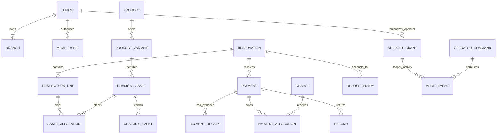

# Drezivo — Logical Database Specification v2

**Revision:** 2.1 · **Date:** 26 September 2026
**Target:** Supabase PostgreSQL. This is an ERD-ready logical specification, not a deployed database or production migration.

The [DBML](Drezivo-ERD-v2.dbml) defines exact types, nullability, keys, indexes and foreign-key relationships. This document specifies business meaning and constraints a diagram cannot enforce. Read with the [PRD](../product/Drezivo-PRD.md) and [TRD](Drezivo-TRD.md). V2 is a reviewed proposal for operator activity and command persistence; it is not an applied migration.

## 1. Design and release boundaries

Start with a shared tenant schema. Create one default branch from day one. Separate catalogue styles, variants and individually tracked garments. A mutable clothing status or quantity is not the source of future booking availability.

V1 presents one garment per checkout and Owner/Front desk operations. Multiple reservation lines are supported structurally for V1.1. Fittings are V1.1; locations/transfers are V2. V3 is governed evolution, not speculative enterprise tables to deploy now.

**Migration boundary:** the DBML includes future entities to show the complete ERD. A V1 migration omits V1.1/V2 tables and their nullable extension columns/FKs (`fitting_id`, `fitting_line_id`, `transfer_line_id`, `location_id` where applicable). Add these in their release. Retain tenant, default branch, variant and reservation-line identities from V1.

## 2. Conventions

- Tenant-owned primary keys are `(tenant_id,id)`. UUIDs are generated server-side; every tenant-owned row directly references `tenant.id`.
- Global tables are `tenant`, `plan`, `plan_entitlement` and `webhook_inbox`. All other foreign references to tenant-owned rows include `tenant_id`; a UUID alone does not prove ownership.
- Required fields carry `[not null]` in DBML. Nullable fields are optional or stage-dependent, not permission to accept incomplete confirmed records. Deletion defaults to `RESTRICT`.
- `created_at` records insertion; `occurred_at` records physical event time. Use `timestamptz` for instants and an IANA timezone snapshot for interpretation. `date` is only for event dates and calendar validity.
- Money uses nonnegative `bigint` minor units and explicit currency. Direction/kind and linked reversals express sign. API amounts are decimal strings; arithmetic uses exact integers/decimals with documented rounding.
- Every status/kind/role/channel receives a SQL CHECK or constrained lookup plus matching boundary validation. `varchar` in DBML is not an unconstrained production state machine. Unknown values reject.
- JSONB holds validated flexible measurements, immutable snapshots and allowlisted configuration/metadata. Relationships and financial postings remain relational.

## 3. Relationship overview



SQL FKs enforce children belonging to existing parents; services/constraint triggers enforce at least one line in an accepted reservation and one default branch. Draft styles may have no variants; a published rentable style may not.

## 4. Tenancy, permissions and historical ownership

`tenant.clerk_org_id` is unique external identity. The internal UUID survives a provider migration. `membership` maps Clerk user identity to a local role/status; `branch_membership` grants explicit capabilities. A branch is an operating unit, not a separate Clerk organization.

Enable RLS on tenant-owned tables. The runtime role must neither own tables nor have BYPASSRLS. Establish tenant/principal context transaction-locally on the same connection as the queries; missing context denies access. Use read policies and write checks. RLS is defense against accidental scope errors, not protection against a fully compromised API.

The API separately checks each action and branch. Cross-tenant FKs fail; same-tenant cross-branch relationships can be valid. A transfer requires permission for its source/destination. A V1 asset allocation must match its default fulfillment branch; fitting settings, hidden capacity slots, slot allocations, hours, closures, appointments and guaranteed fitting assets must agree on the appointment branch. Enforce these domain consistency rules in addition to tenant FKs.

Historical branch fields on bookings/custody are immutable facts. Changing an asset's current branch does not rewrite prior branch reporting. Separate franchise legal businesses remain separate tenants until an explicit group model exists.

`audit_event` holds redacted action metadata. V2 records `actor_kind`, `outcome`, and `occurred_at` explicitly so support activity can be queried without inferring facts from action names or insertion time. `support_grant` defines an operator subject, permissions, reason, expiry and revocation for one tenant. Its actor namespace accommodates staff/operator/system identities; an operator is not automatically a tenant member. Private evidence access needs an explicit additional capability.

`operator_command` is the durable record for an authorized operational command. It binds the
operator subject, tenant, reason, request ID, idempotency intent, resource kind and resource ID to
one state transition. A retry command must create or replay this record before enqueueing work; it
cannot mutate an outbox or notification row directly from an HTTP handler. The command row is also
the audit correlation point for support activity and post-event review. Request IDs remain bounded
text so distributed tracing identifiers from HTTP and worker paths are preserved; they are not
required to be UUIDs.

The database keeps `redacted_summary` as validated JSONB for structured internal evidence. The
operator projection serializes only a short, allowlisted summary string; it never exposes raw JSON,
provider payloads, credentials, or unrestricted personal data.

### v2 rollout order

The v2 migration is intentionally staged. `0021_operator_command_audit_v2.sql` adds the new
nullable audit fields, performs a bounded backfill, and creates the command table without changing
the old writer's required columns. Deploy the writer that supplies the new fields, verify the
backfill, then apply `0022_operator_v2_constraints.sql` to enforce the actor/outcome checks and
stable activity indexes. This keeps rolling deployments compatible and avoids a single migration
holding a large unbounded update or breaking the previous API version.

### Request-time actor and workspace resolution (TBF-031)

The Clerk token's active organization is the only tenant selector accepted by the staff API. The
API resolves that opaque organization ID to `tenant`, verifies the authenticated Clerk user has an
active local `membership`, and then resolves active `branch` rows, the selected branch's
`branch_membership` grant, the current `subscription`, and the selected plan's
`plan_entitlement` limits in one actor-context read. A branch header is a selector among branches
already authorized by that membership; it is never an authority or a substitute for the token
organization.

Workspace discovery is intentionally a narrow global read rather than a global RLS bypass. The
`resolve_actor_workspaces` SECURITY DEFINER function accepts only transaction-local account
principal context and returns tenant identity, lifecycle status, and role for active memberships.
It refuses to operate while `app.tenant_id` is set. All subsequent tenant reads use the ordinary
forced-RLS transaction context. Missing, foreign, suspended, or removed memberships fail closed;
restricted and cancelled tenant states resolve so the shared action policy can decide which safe
operations remain available.

## 5. Catalogue, planned availability and actual custody

### Three identities

**Emerald gown** is a product; **medium/green** is its variant; **GWN-0042** is the physical garment. Alterations can make two assets of the same variant differ. Store units with measurements, asset overrides and alteration notes; snapshot offered facts on the reservation line.

A tenant may also keep reusable `measurement_guide` records backed by accepted file objects. A variant declares one explicit measurement source: `default_guide`, `custom`, or `none`. `default_guide` stores the exact guide ID selected when the variant is created; replacing the tenant default later creates/selects another guide and does not silently rewrite existing clothing. `custom` uses the variant's structured `measurements` JSON; `none` keeps that map empty. This makes an empty measurement map unambiguous and prevents one shared size-chart image from being duplicated for every product/size.

The V1 staff creation experience deliberately hides most serialized-asset mechanics: the owner selects sizes once, shared color/pricing/timing are copied into generated variants, and the service creates one active physical asset for each selected size. Each product has one active sizing mode: `sized` uses one or more non-null size labels, while `free_size` uses exactly one active variant with a `NULL` size label. The modes cannot be mixed, and the ordinary add-variant command cannot cross the mode boundary. Mode changes are the explicit migration path: they archive the previous active variants instead of deleting them, preserving reservations, fittings, allocations, and asset history; switching back restores the preserved Free size variant when available. Multiple physical assets may still reference one variant later when a business owns duplicate pieces of the same size.

Each reservation line represents one serialized garment. There is no quantity that can claim five units while allocating one. Historical substitutions may leave several released allocations for a line, but at most one current blocking asset allocation per line is allowed.

### Canonical planned block

`asset_allocation` is the only planned unavailability table. Exactly one source is non-null: reservation line, maintenance work order, fitting line, or transfer line. `kind` agrees with that source. Manual blocks use a work order of kind `manual_block`.

`period` is a finite, nonempty half-open `tstzrange` including preparation and turnaround. Required PostgreSQL protection:

```sql
-- Illustrative constraint, not a complete migration.
CREATE EXTENSION IF NOT EXISTS btree_gist;
ALTER TABLE asset_allocation
  ADD CONSTRAINT asset_allocation_no_overlap
  EXCLUDE USING gist
    (tenant_id WITH =, asset_id WITH =, period WITH &&)
  WHERE (is_blocking);
```

Add range shape/bounds checks and a partial unique index on `(tenant_id,reservation_line_id)` where `is_blocking AND reservation_line_id IS NOT NULL`. Use GiST for interval overlap; ordinary B-tree indexes are not a substitute.

Initial hold, pending review, confirmed rental and reserved turnaround all block. Cancelled/expired/released allocations do not. Store the deterministic flag transactionally; do not use `now()` in an index predicate. Confirmation retains the same allocation. Expiry releases it before another claim can succeed.

Cleaning inside an existing Recovery period uses that same block; inserting another overlapping cleaning block would be incorrect. Normal on-time return may set `readiness='needs_cleaning'` with `recovery_managed_readiness=true`; the reservation allocation remains the timing authority and the readiness value is current-condition metadata, not a second future block. Staff may mark Ready early and shorten only the post-due Recovery tail. After that tail ends, normal Recovery-managed cleaning becomes schedulable and a worker reconciles readiness to Ready. Extra planned maintenance gets a separate nonoverlapping block. Repair, explicit unready states, open maintenance, and late returns remain persistent and require deliberate readiness resolution. If unexpected damage cannot extend a block because it conflicts with a later booking, preserve the physical unready state and create a disruption rather than claiming the garment is ready.

### Actual truth

`custody_event` is append-only and outside the overlap exclusion. Actual late return must be recordable. Lock the asset's current projection and conditionally record handover/return once; update custody/readiness in that transaction. A `disruption` identifies threatened future lines and resolution work.

Pickup requires confirmed booking, allocation, physical presence, readiness, policy/payment prerequisites and permission. Return does not imply immediate readiness; normal Recovery-managed cleaning and persistent repair/manual readiness states follow the rules above. No “available” override may bypass another booking or erase custody history.

## 6. Reservation states and transaction recipes

| State                                           | Allowed transition                                                                      |
| ----------------------------------------------- | --------------------------------------------------------------------------------------- |
| `held`                                          | `pending_confirmation`, `cancelled`, `expired`                                          |
| `pending_confirmation`                          | `confirmed`, `rejected`, `cancelled`, `expired`                                         |
| `confirmed`                                     | `picked_up`, `cancelled`; atomic reschedule retains state                               |
| `picked_up`                                     | `returned`; cannot cancel into available                                                |
| `returned`                                      | `completed` after inspection and settlement checklist; asset readiness remains separate |
| `completed`, `cancelled`, `expired`, `rejected` | Terminal; append financial corrections or create another reservation                    |

An anonymous short hold may lack a customer row/contact. Submission requires validated contact, terms acceptance and complete snapshots. Do not create fake empty customers to satisfy an early FK.

**Hold:** validate and compute quote → lock candidate assets in sorted order → explicitly release expired holds using database time → insert header/line/block → commit idempotency outcome. QR instructions appear only after commit. Initial TTL is 15 minutes; evidence submitted before expiry extends review to no later than 24 hours from initial acquisition. These are proposed pilot policy values; accepted deadlines must not drift silently.

**Approval versus expiry:** lock reservation and assets, compare deadline, then conditionally transition once. Record actual merchant-account/cash verification and verified money. A genuine late payment can still be recorded when confirmation fails; route to refund/fresh-booking exception handling, never resurrection.

**Reschedule:** lock old/new assets in deterministic order, validate new price/terms and replace allocation inside one transaction. Conflict rolls back all changes and preserves the old booking. Never commit old-slot release before new-slot acquisition.

**Cancellation:** before handover, release future block and record any refund obligation according to the snapshot. External manual refund completion is separate. After handover use return/settlement workflows.

Reject unknown transitions and stale versions. Receipt replacement does not extend the maximum review deadline. On early return keep booked turnaround unless an explicit safe release validates readiness and policy.

## 7. Operational financial subledger

This is not a general ledger or certified tax-invoicing system. `payment` starts as a guarded mutable intent; verified amount/currency/reference become immutable. Evidence and review decisions are separate. `charge`, `payment_allocation` and `deposit_entry` are append-only postings. `refund` has controlled workflow state; completed monetary facts cannot be overwritten. Enforce this through runtime privileges and database guards.

### Posting meanings

- `charge`: rental, delivery, approved late/damage fee, or linked credit. Security liability is not a revenue charge.
- `payment_allocation`: apply money to a charge; reverse only through a linked entry and bounded original amount.
- `deposit_entry`: receive money into security holding; apply it to an approved charge; release it into a refund instruction; reverse by explicit link.
- `refund`: requested/processing/completed/failed/cancelled. Pending instructions reserve capacity immediately. Only verified completion means money returned. Failure/cancellation restores associated reserved balances atomically.

Each financial command has a permanent `(tenant_id,business_key)` unique key. Content hashes cannot substitute for business intent. These keys outlive HTTP retry-cache retention.

### Balances and concurrency

For one verified payment in one currency:

- `P`: verified received amount.
- `A`: net charge allocations (apply minus linked reversals).
- `H`: net security holding (receive minus apply/release, adjusted by linked reversals).
- `R`: refund instructions requested/processing/completed; cancelled/failed excluded after balance restoration.
- `U = P − A − H − R`: unassigned money. Require A, H, R and U all nonnegative.

A security release decreases H and creates the matching refund instruction R atomically. This reclassifies holding to **refund payable**, not proof of cash leaving the account. Outstanding security liability includes H plus pending security refunds; completed refunds discharge it. Deposit application decreases H and increases A against an approved charge. Rental refunds reverse relevant allocations and adjust the charge when required by policy. Never double count a refund as two outflows.

Lock the payment row before summing/inserting any postings; lock related charges and reservations in a consistent documented order. Recompute residuals inside the transaction. Different idempotency keys still cannot over-refund. Cap allocation per charge at net collectible value and reversals at their original un-reversed amount.

Same-tenant FKs cannot prove matching currency or reservation. Validate these cross-row invariants in domain transactions and deferred constraint triggers where appropriate. Do not use a row CHECK to pretend to enforce an aggregate balance across concurrent rows.

Partial monetary refunds and damage deductions belong in V1. Partial physical returns belong in V1.1's multi-item UI. Financial exceptions can outlive operational completion without rewriting custody facts.

## 8. SaaS billing, files and durable jobs

`plan` is versioned by `(code,version)`: confirmed monthly amounts are **30000 / 49900 / 129900 PHP minor units** for Starter/Professional/Business. Entitlement and release availability must both pass; a null numerical limit is not implicitly unlimited. `subscription` is current state, `subscription_event` preserves changes and `subscription_payment` records Drezivo collections only. They never feed renter-payment balances. TBF-033 reconciles trial and grace expiry from database time at request time and in the durable worker; deterministic event keys make delayed or duplicate jobs safe. Only the Owner may change a trial plan, and target-plan capacity is checked against active physical assets and active Front Desk memberships before the plan pointer changes.

The TBF-032 entitlement service is the single runtime resolver for the current active
version-1 plan. It validates the subscription, plan, and required `physical_assets.max` and
`frontdesk_seats.max` rows before returning the safe plan snapshot used by actor context and
tenant bootstrap. Quota guards lock the tenant row on the caller's transaction, count active
physical assets and active Front Desk memberships plus unexpired pending invitations, and hold that
lock through the caller's write; the Owner membership is not a seat. TBF-040 owns the invitation
reservation row and its database-time expiry in `0019_membership_invitations.sql`.
Plan and entitlement rows remain migration-owned: `0018_entitlement_runtime_privileges.sql`
leaves runtime roles read-only for those tables.

Bootstrap starts a fourteen-day trial from database time. Trial expiry enters a seven-day normal-access
`past_due` grace. Restrictions preserve existing-rental fulfillment, refunds and export. One current
subscription per tenant; no silent repricing of an existing period.

`file_object` stores purpose, ownership, content metadata, accepted version/checksum and retention. An available evidence object needs frozen bytes: exact version or immutable final-key strategy. A reusable upload URL must not change accepted evidence. Private evidence cannot become public through an arbitrary boolean change. Retention/deletion includes versions and derivatives; legal holds are explicit.

`guest_access_token` stores only a secret hash, one-reservation scope, expiry and revocation. `idempotency_record.principal_key` uses server-derived staff/checkout namespaces, not an arbitrary client user ID.

`outbox_event` persists pending/leased/succeeded/dead, lease token/deadline, attempts and retry bound. Stable event keys deduplicate work; external delivery remains at-least-once. `notification_delivery` distinguishes provider acceptance from actual delivery/failure. Global `webhook_inbox` uses exact-raw signature verification, canonical event type, unique provider/event identity and a restricted worker with minimal safe payload.

`import_job` supports preview and bounded atomic V1 imports; invalid rows write nothing. `export_job` records scope and an expiring private result. Recheck authorization at download and escape CSV formula injection. Logs/exports never expose bearer secrets or unrestricted private URLs.

## 9. Fittings and transfers

**V1.1 fittings:** the approved product surface has no room/staff/named-resource assignment. Capacity is branch-scoped and hidden from the UI. `fitting_settings.capacity` defines maximum simultaneous fittings; the backend materializes capacity `N` as `N` internal `fitting_capacity_slot` rows. Each pending/confirmed fitting owns one blocking `fitting_slot_allocation` for its exact appointment period. PostgreSQL exclusion on `(tenant_id, slot_id, period)` prevents overlapping use of one slot; configuration/booking mutation is serialized against branch fitting settings so capacity correctness never depends on `count then insert`.

`fitting_settings` owns only fitting-specific enabled state, maximum simultaneous capacity, one strict duration and one optional fixed fee. Branch Business Hours are canonical in `branch.operating_hours`: one opening time, one closing time, and recurring closed weekdays shared by Calendar and fitting availability. `branch_closure` stores whole-day special closed dates with bounded reasons. A new/rescheduled fitting must fit fully inside Business Hours, occur on an open weekday, avoid `branch_closure`, claim a capacity slot and claim every guaranteed garment. Branch timezone is authoritative and the appointment snapshots it.

Canonical appointment states are `pending`, `confirmed`, `completed`, `rejected`, `cancelled`, `no_show`. Create always starts `pending`; allowed transitions are `pending -> confirmed|rejected|cancelled` and `confirmed -> completed|cancelled|no_show`. Completed/rejected/cancelled/no_show are terminal. Reject/cancel require a bounded internal reason. No clock-driven status mutation exists. Once scheduled start is reached, reschedule, garment-plan edits, reject and normal cancel are forbidden; no-show is allowed after start and complete only at/after end. Normal staff operations never hard-delete fittings.

A fitting line without an asset is a preference, not a garment guarantee. A guaranteed line requires an atomically selected eligible physical asset plus canonical `asset_allocation` for exactly the fitting period. Drezivo chooses the asset through the same deterministic serialized-garment allocator used by reservations. Pending fittings already hold both hidden capacity and guaranteed garments. Future pending/confirmed garment changes and reschedules atomically secure replacements before releasing old claims; failure leaves the old appointment intact.

Every fitting references a real customer. Staff-created walk-ins require full name plus phone or email; duplicate contact detection is advisory and never an automatic merge. Fitting configuration is Owner-only; Owner and Front Desk may perform operational commands. One optional bounded internal note is staff-only.

A positive snapshotted fitting fee creates an immutable `fitting_fee` charge. Payment/evidence remains independent and never gates confirmation. Rejection/cancellation/no-show do not auto-refund. Meaningful fitting mutations use existing audit/idempotency conventions; the first fitting slice sends no customer-facing fitting reminders/notifications, though outbox-safe events may be recorded for later consumers.

**V2:** `location` is physical branch storage. `transfer_order` has distinct source/destination; `transfer_line` tracks each unit; `transfer_event` captures dispatch/receipt/loss. Requesting a transfer does not move inventory. Dispatch marks transit custody; receipt updates branch/location through a winning transition. Partial receipt changes only arrived lines. Planned transit uses canonical blocks and lead-time checks.

Delayed/lost transfers create disruptions instead of phantom destination stock. Actual events remain recordable when a future promise fails. Authorize relevant branches and reject duplicate dispatch/receipt. V3 group/legal-entity reporting requires its own reviewed requirements.

## 10. Mandatory SQL invariants beyond DBML

1. Tenant RLS read/write policies, restricted roles, branch authorization.
2. Asset/fitting-slot exclusions; nonempty finite `[)` ranges; one active asset assignment per guaranteed fitting line and one active hidden capacity slot per scheduled fitting.
3. Exactly one block source, matching kind/asset/variant/branch; stage-specific completeness.
4. Default-branch partial uniqueness plus required default creation; global normalized storefront slugs.
5. State-machine/version guards; amount/currency bounds; financial immutability and concurrency-safe aggregates.
6. Source-booking/currency agreement across financial links; bounded reversal chains.
7. File finalization, scope validation, outbox/webhook deduplication and lease checks.
8. Published-store prerequisites; asset/seat quotas enforced under tenant lock.
9. Transfer/fitting consistency, 30-minute fitting grid/duration constraints, branch Business Hours/closure guards, and winning fitting state transitions.
10. FK indexes not covered by existing prefixes, GiST interval indexes, due-work/expiry indexes. Measure before adding partitions or blanket indexes.

## 11. Falsification checklist

- Different users/keys claim one asset concurrently: one blocking allocation. Adjacent intervals succeed; overlap fails.
- Sequential/concurrent same-intent replay produces one effect; changed payload rejects. Retry after lost response.
- Approval races expiry/rejection: one state result, no duplicate money; actual late funds record as an exception.
- Failed reschedule preserves old assignment, accepted prices and policies.
- Late return persists and flags next booking; unready handover denies.
- Concurrent refunds jointly exceed balance: cap holds. Exercise deposit receive/apply/release/reversal and refund failure restoration.
- Cross-tenant IDs fail at FK/auth boundaries; valid cross-branch transfers require permissions.
- Reused pooled connections, missing context, rollback and revoked memberships cannot leak data.
- Reused upload URL cannot change approved evidence; foreign attachments reject.
- Worker crashes before/after provider acceptance recover leases and preserve financial deduplication.
- Fitting slot/garment contention: simultaneous creates/reschedules never exceed branch capacity or double-allocate a garment; failed replacement preserves the original fitting. Duplicate dispatch, partial and delayed transfer receipt preserve physical truth.

These are implementation acceptance tests. Parser validation proves diagram syntax/relationships only; Supabase PostgreSQL migrations and concurrency still require real integration tests.

## 12. Entity dictionary

The dictionary below is generated from the same reviewed schema as the DBML. Each entity has `id` and `created_at`; tenant-owned entities also have `tenant_id`. Exact types/required fields and unique keys are in DBML. A `>` reference means many-to-one; unique child keys narrow cardinality as applicable. Stage-dependent minimums are specified above.

| Entity                            | First release | Domain fields (common keys omitted)                                                                                                                                                                                                                                                                                                                                                                                                                                                                                        | Meaning / relationship rule                                                                                                                                                                                          |
| --------------------------------- | ------------- | -------------------------------------------------------------------------------------------------------------------------------------------------------------------------------------------------------------------------------------------------------------------------------------------------------------------------------------------------------------------------------------------------------------------------------------------------------------------------------------------------------------------------- | -------------------------------------------------------------------------------------------------------------------------------------------------------------------------------------------------------------------- |
| `account`                         | V1 foundation | `clerk_user_id`, `trial_consumed_at` (optional), `current_owned_tenant_id` (optional)                                                                                                                                                                                                                                                                                                                                                                                                                                      | Global identity/minimum lifecycle state. One verified person may have many Front Desk memberships but one current owned tenant and one lifetime trial. No Clerk profile mirror.                                      |
| `organization_onboarding`         | V1 foundation | `account_id`, `clerk_org_id`, `organization_name`, `requested_slug` (optional), `status`, `selected_plan_code` (optional), `provisioned_tenant_id` (optional), timestamps                                                                                                                                                                                                                                                                                                                                                                                                    | Global pre-tenant state. Exactly one incomplete/payment-pending record per account; Clerk organization unique; abandonment retains audit history. Organization name and requested slug are the only owner-supplied identity fields in this phase. Owner profile fields, branch address, business type, and operating setup belong to tenant bootstrap.                                                                    |
| `onboarding_payment_verification` | V1 foundation | `organization_onboarding_id`, `operator_subject`, `amount_minor`, `currency`, `payment_reference`, `status`, `business_key`                                                                                                                                                                                                                                                                                                                                                                                                | Global immutable manual-payment evidence. A payment-pending record creates no tenant until verified activation wins.                                                                                                 |
| `owner_onboarding_attempt`        | V1 foundation | `account_id`, `idempotency_record_id`, `attempt_id`, `organization_name`, `requested_slug` (optional), `provider_org_id` (optional), `status`, timestamps                                                                                                                                                                                                                                                                                                                                                         | Durable single-flight state for the external Clerk organization create. It prevents duplicate provider calls and permits exact signed-marker repair after an unknown outcome.                                                                                         |
| `bootstrap_idempotency_record`    | V1 foundation | `account_id`, `operation`, `intent_key`, `payload_hash`, `status`, `response_code`, `safe_response`, `expires_at`, `created_at`                                                                                                                                                                                                                                                                                                                                                                                            | Global bootstrap idempotency because the existing `idempotency_record` is tenant-scoped. Expired rows are atomically reclaimable; terminal responses are bounded and replay-safe.                                       |
| `global_audit_event`              | V1 foundation | `account_id` (optional), `actor_kind`, `actor_key`, `action`, `entity_type`, `entity_id` (optional), `outcome`, `redacted_summary`, `request_id`                                                                                                                                                                                                                                                                                                                                                                             | Append-only pre-tenant audit history. Account reads are owner-scoped; operator/system reads require explicit transaction context and an account/entity filter. No runtime update/delete privileges.                   |
| `tenant`                          | V1            | `clerk_org_id`, `name`, `slug`, `status`, `currency`, `timezone`, `updated_at`                                                                                                                                                                                                                                                                                                                                                                                                                                             | Business isolation boundary. Status active/restricted/cancelled; created only by bootstrap and retained after provider loss.                                                                                         |
| `branch`                          | V1            | `name`, `code`, `is_default`, `timezone`, `address`, `operating_hours`, `operating_hours_version`, `operating_hours_updated_at`, `status`                                                                                                                                                                                                                                                                                                                                                                                                                                           | One default branch in V1; multiple in V2. Partial unique default and at-least-one default enforced in migrations/service.                                                                                            |
| `membership`                      | V1            | `clerk_user_id`, `clerk_membership_id` (optional), `role`, `status`, `authz_version`, `updated_at`                                                                                                                                                                                                                                                                                                                                                                                                                         | owner/frontdesk initially; status active/suspended/removed. Local status check required on every protected request. A verified invitation claim records the exact Clerk membership ID under a tenant-scoped unique index; provider membership events alone never create local access. |
| `branch_membership`               | V1            | `branch_id`, `membership_id`, `permission_codes`                                                                                                                                                                                                                                                                                                                                                                                                                                                                           | One default grant V1. V2 server validates branch-scoped capabilities; JSON codes are allowlisted.                                                                                                                    |
| `membership_invitation`           | V1 foundation | `email_digest`, encrypted recipient email, `status`, `expires_at`, `clerk_invitation_id` (optional), `business_key`, `dispatch_version`                                                                                                                                                                                                                                                                                                                                                                                                        | Tenant-owned Front Desk invitation intent. Seven-day database-time expiry; pending invite counts against the seat cap; recipient material is protected; only a verified Drezivo claim matching the accepted provider invitation and current dispatch marker activates membership. |
| `customer`                        | V1            | `full_name`, `email` (optional), `phone` (optional), `address` (optional, max 500), `social_media` (optional, max 320), `notes` (optional), `privacy_notice_version`, `archived_at` (optional), `updated_at`, `anonymized_at` (optional)                                                                                                                                                                                                                                                                                            | At least one usable contact remains required. Staff profile edits use tenant idempotency and optimistic `updated_at`, normalize email to lowercase, and never rewrite historical reservation snapshots. Archive is an operational flag, not deletion or anonymization; archived profiles remain readable for existing history and are excluded from new intake. PostgreSQL integration evidence for these mutations remains pending. |
| `category`                        | V1            | `name`, `visible`, `display_order`                                                                                                                                                                                                                                                                                                                                                                                                                                                                                         |                                                                                                                                                                                                                      |
| `product`                         | V1            | `category_id`, `code`, `name`, `description`, `sizing_mode`, `status`                                                                                                                                                                                                                                                                                                                                                                                                                                                                             | Style-level marketing entry, not stock quantity. `sizing_mode` is `sized` or `free_size`; active variants may use only that mode. Mode changes archive old variants so historical references remain valid. `code` is a tenant-local, case-insensitively unique clothing identifier; owners may supply it or let the API generate it.                                                                              |
| `measurement_guide`               | V1            | `file_id`, `name`, `status`, `is_default`, `updated_at`                                                                                                                                                                                                                                                                                                                                                                                                                                                                    | Reusable tenant measurement/size-chart image. At most one active default per tenant. Replacing the default does not rewrite variants already referencing an older guide.                                             |
| `product_variant`                 | V1            | `product_id`, `sku`, `size_label` (nullable), `color_label`, `measurements`, `measurement_unit`, `measurement_mode`, `measurement_guide_id` (optional), `rental_price_minor`, `security_deposit_minor`, `currency`, `pricing_mode`, `included_duration_minutes`, `extra_day_price_minor`, `prep_minutes`, `turnaround_minutes`, `status`                                                                                                                                    | `NULL size_label` is the canonical Free size variant; free-size products have one active null-size variant and sized products require real labels. Archived variants preserve prior mode history. `measurement_mode` is default_guide/custom/none; pricing mode fixed_duration/daily; explicit nonnegative amounts and bounded minutes. |
| `physical_asset`                  | V1            | `branch_id`, `variant_id`, `asset_code`, `lifecycle_status`, `retired_by_product_archive`, `readiness`, `recovery_managed_readiness`, `custody_kind`, `condition_note` (optional), `measurement_overrides`, `alteration_note` (optional), `location_id` (optional), `version`                                                                                                                                                                                                                                                                                                          | branch_id is administrative home/holding branch; actual custody can be customer/transit. Location optional until V2.                                                                                                 |
| `file_object`                     | V1            | `purpose`, `storage_key`, `version_id` (optional), `sha256` (optional), `mime_type`, `byte_size`, `lifecycle_status`, `is_private`, `upload_expires_at`, `frozen_at` (optional), `retention_until` (optional), `legal_hold`, `deleted_at` (optional)                                                                                                                                                                                                                                                                       | Accepted/frozen bytes back catalogue images, reusable measurement guides, evidence and other governed files. Upload expiry is not evidence retention. Delete all applicable versions.                                |
| `product_image`                   | V1            | `product_id`, `file_id`, `display_order`                                                                                                                                                                                                                                                                                                                                                                                                                                                                                   | At most five ordered photos per product; order zero is the primary image. Only public derivatives may be exposed.                                                                                                  |
| `storefront`                      | V1            | `branch_id`, `slug`, `status`, `branding`, `contact`, `published_at` (optional)                                                                                                                                                                                                                                                                                                                                                                                                                                            | One storefront per tenant initially, globally unique path slug. Branch selector added V2 without duplicating tenant identity.                                                                                        |
| `policy_snapshot`                 | V1            | `storefront_id`, `version`, `rental_rules`, `deposit_rules`, `cancellation_rules`, `delivery_rules`, `privacy_notice`, `effective_at`                                                                                                                                                                                                                                                                                                                                                                                      | Immutable policy version once referenced. Terms acceptance stored on reservation.                                                                                                                                    |
| `payment_method`                  | V1            | `name`, `rail`, `destination_snapshot`, `qr_file_id` (optional), `active`, `storefront_enabled`, `version`                                                                                                                                                                                                                                                                                                                                                                                                                                       | Tenant-owned payment method. `active` controls staff availability; `storefront_enabled` is owner intent for public checkout. Cash is staff-only; online methods are public only when enabled and configuration-ready. New version rather than changing already shown instructions; rail cash/manual_qr/manual_transfer.                                                                  |
| `reservation`                     | V1            | `branch_id`, `customer_id` (optional), `storefront_id`, `policy_snapshot_id`, `payment_method_id`, `reference_code`, `status`, `event_date` (optional), `pickup_at`, `due_at`, `timezone_snapshot`, `customer_snapshot`, `delivery_snapshot`, `price_snapshot`, `currency`, `rental_total_minor`, `security_required_minor`, `due_now_minor`, `hold_acquired_at`, `hold_expires_at` (optional), `terms_accepted_at` (optional), `submitted_at` (optional), `confirmed_at` (optional), `completed_at` (optional), `version` | Customer/contact may be absent for anonymous short hold; required before pending_confirmation. Snapshot fields validated by state. Canonical reservation states in model doc.                                        |
| `reservation_line`                | V1            | `reservation_id`, `variant_id`, `line_number`, `name_snapshot`, `measurements_snapshot`, `pricing_snapshot`, `rental_minor`, `deposit_minor`, `currency`                                                                                                                                                                                                                                                                                                                                                                   | One serialized garment per line. One line in V1 UI. No quantity greater than one; allocation assigns the physical asset.                                                                                             |
| `maintenance_work_order`          | V1            | `branch_id`, `asset_id`, `kind`, `status`, `reason`, `opened_at`, `closed_at` (optional)                                                                                                                                                                                                                                                                                                                                                                                                                                   | cleaning/repair/manual_block; planned interval represented by asset_allocation. Actual readiness independently checked.                                                                                              |
| `asset_allocation`                | V1            | `branch_id`, `asset_id`, `reservation_line_id` (optional), `maintenance_id` (optional), `fitting_line_id` (optional), `transfer_line_id` (optional), `kind`, `period`, `is_blocking`, `released_at` (optional)                                                                                                                                                                                                                                                                                                             | Exactly one source FK. EXCLUDE gist tenant_id =, asset_id =, period && WHERE is_blocking. Nonempty bounded [) range. Holds/pending/confirmed/turnaround all block; deterministic transition contract.                |
| `custody_event`                   | V1            | `branch_id`, `asset_id`, `reservation_line_id` (optional), `transfer_line_id` (optional), `actor_membership_id`, `event_kind`, `occurred_at`, `condition_snapshot`, `business_key`                                                                                                                                                                                                                                                                                                                                         | Immutable actual facts independent of planned exclusion. Exactly matching intent is duplicate-safe; real lateness never rejected due to future allocations.                                                          |
| `disruption`                      | V1            | `asset_id`, `reservation_line_id`, `cause_custody_event_id` (optional), `reason`, `status`, `resolved_at` (optional)                                                                                                                                                                                                                                                                                                                                                                                                       | Overdue/unready asset threatens upcoming booking; operator resolves substitute/new dates/refund with customer. Do not silently auto-cancel.                                                                          |
| `payment`                         | V1            | `reservation_id` (optional), `fitting_id` (optional), `payment_method_id`, `amount_minor`, `currency`, `status`, `merchant_reference` (optional), `verified_at` (optional), `business_key`                                                                                                                                                                                                                                                                                                                                 | Exactly one reservation/fitting. Pending intent may change through guards; verified amount/currency/reference immutable; corrections use reversals. Merchant reference uniqueness needs method/provider scope.       |
| `payment_receipt`                 | V1            | `payment_id`, `file_id`, `evidence_status`, `submitted_at`                                                                                                                                                                                                                                                                                                                                                                                                                                                                 | Evidence does not imply receipt of funds. File must be finalized, private, same tenant.                                                                                                                              |
| `payment_verification`            | V1            | `payment_id`, `verifier_membership_id`, `decision`, `verified_amount_minor` (optional), `evidence_note`, `decided_at`, `business_key`                                                                                                                                                                                                                                                                                                                                                                                      | Immutable review decisions; only one successful settlement per payment via locked conditional transition. Private notes not application logs.                                                                        |
| `charge`                          | V1            | `reservation_id` (optional), `fitting_id` (optional), `kind`, `amount_minor`, `currency`, `reverses_id` (optional), `business_key`                                                                                                                                                                                                                                                                                                                                                                                         | Immutable nonnegative charge or linked credit/reversal. Exactly one rental/fitting. Security deposit liability is not a revenue charge.                                                                              |
| `payment_allocation`              | V1            | `payment_id`, `charge_id`, `amount_minor`, `direction`, `reverses_id` (optional), `business_key`                                                                                                                                                                                                                                                                                                                                                                                                                           | Immutable apply/reverse toward charge; reversal bounded by original. Same booking and currency required beyond tenant FK.                                                                                            |
| `refund`                          | V1            | `payment_id`, `amount_minor`, `currency`, `purpose`, `status`, `merchant_reference` (optional), `requested_by`, `completed_at` (optional), `business_key`                                                                                                                                                                                                                                                                                                                                                                  | requested/processing/completed/failed/cancelled; reserve refundable balance for pending instructions. Manual completion verified; never reissue automatically on uncertain transfer.                                 |
| `deposit_entry`                   | V1            | `reservation_id`, `payment_id`, `charge_id` (optional), `refund_id` (optional), `kind`, `amount_minor`, `currency`, `reverses_id` (optional), `business_key`                                                                                                                                                                                                                                                                                                                                                               | Immutable receive/release/apply/reversal. Exactly linked financial effect; apply pairs with charge payment allocation and release with refund. See balance formulas.                                                 |
| `guest_access_token`              | V1            | `reservation_id`, `token_hash`, `scope_codes`, `expires_at`, `revoked_at` (optional)                                                                                                                                                                                                                                                                                                                                                                                                                                       | High entropy bearer secret only returned once, hash stored; scopes allowlisted per state. Reference is not auth.                                                                                                     |
| `idempotency_record`              | V1            | `principal_key`, `operation`, `intent_key`, `payload_hash`, `status`, `resource_id` (optional), `response_code` (optional), `safe_response` (optional), `expires_at`                                                                                                                                                                                                                                                                                                                                                       | Principal includes staff or anonymous checkout session namespace; terminal business keys outlive request cache.                                                                                                      |
| `outbox_event`                    | V1            | `dedupe_key`, `event_type`, `payload`, `status`, `lease_token` (optional), `lease_until` (optional), `attempts`, `max_attempts`, `available_at`, `completed_at` (optional), `safe_last_error` (optional)                                                                                                                                                                                                                                                                                                                   | pending/leased/succeeded/dead; at-least-once. Payload minimum IDs, no bearer secrets. Worker tenant scopes each domain operation.                                                                                    |
| `webhook_inbox`                   | V1            | `provider`, `provider_event_id`, `event_type` (nullable only for legacy rows), `payload_digest`, `safe_payload`, `status`, `processed_at` (optional)                                                                                                                                                                                                                                                                                                                                                                      | Global pre-tenant inbox. API has an insert-only ingestion path; the worker alone reads/transitions received rows. Canonical organization/invitation/membership event names are stored with no raw token/PII payload. |
| `notification_delivery`           | V1            | `outbox_id`, `channel`, `template_version`, `status`, `provider_message_id` (optional), `accepted_at` (optional), `delivered_at` (optional)                                                                                                                                                                                                                                                                                                                                                                                | Recipient resolved from authorized record at send time; queued vs provider accepted vs delivered/bounced distinguished.                                                                                              |
| `audit_event`                     | V2 proposal   | `actor_kind`, `actor_key`, `support_grant_id` (optional), `action`, `entity_type`, `entity_id` (optional), `outcome`, `redacted_summary`, `request_id`, `occurred_at`                                                                                                                                                                                                                                                                                                                                                                                              | Append-only metadata for support activity. Actor kind and outcome are explicit; `occurred_at` is the event time used by the stable cursor. No full before/after sensitive payloads.                                                                                                         |
| `operator_command`                | V2 proposal   | `command_kind`, `resource_kind`, `resource_id`, `operator_subject`, `reason`, `request_id`, `intent_key`, `status`, `accepted_at`, `completed_at` (optional), `failure_code` (optional)                                                                                                                                                                                                                                                                                                                                                                                              | Durable authorization and idempotency record for retry and support commands. One intent produces one command; state transitions are conditional and append an audit event.                                                                                                         |
| `import_job`                      | V1            | `requested_by`, `file_id`, `status`, `content_hash`, `intent_key`, `result_summary`, `completed_at` (optional)                                                                                                                                                                                                                                                                                                                                                                                                             | Preview validates rows; commit all-or-nothing for V1 bounded imports. Larger batches explicit later, no silent partial success.                                                                                      |
| `export_job`                      | V1            | `requested_by`, `scope_snapshot`, `status`, `result_file_id` (optional), `expires_at`, `completed_at` (optional)                                                                                                                                                                                                                                                                                                                                                                                                           | Durable queue record; permission rechecked at download. Generated CSV protects formula injection.                                                                                                                    |
| `plan`                            | V1            | `code`, `version`, `monthly_minor`, `currency`, `active`                                                                                                                                                                                                                                                                                                                                                                                                                                                                   | Owner confirmed Starter30000 Professional49900 Business129900 PHP minor units/month. TBF-030 seeds version 1 before bootstrap; immutable price versions.                                                                 |
| `plan_entitlement`                | V1            | `plan_id`, `capability`, `limit_value` (optional), `enabled`                                                                                                                                                                                                                                                                                                                                                                                                                                                               | TBF-030 seeds `physical_assets.max` (125/300/1,000) and `frontdesk_seats.max` (0/2/10). Limits and release flags both required; null means nonnumeric capability, not implicitly unlimited. |
| `subscription`                    | V1            | `plan_id`, `status`, `trial_ends_at` (optional), `current_period_start`, `current_period_end`, `grace_ends_at` (optional), `cancel_at_period_end`, `provider_reference` (optional)                                                                                                                                                                                                                                                                                                                                         | Current subscription one/tenant. Trialing/active/past_due/restricted/cancelled lifecycle; versioned plan pointer; history captured in subscription_event. Restriction preserves approved existing-rental settlement. |
| `subscription_event`              | V1            | `subscription_id`, `prior_plan_id` (optional), `next_plan_id`, `event_type`, `effective_at`, `business_key`                                                                                                                                                                                                                                                                                                                                                                                                                | Immutable commercial transition history; no silent repricing existing period.                                                                                                                                        |
| `subscription_payment`            | V1            | `subscription_id`, `amount_minor`, `currency`, `status`, `collection_method`, `provider_reference` (optional), `business_key`                                                                                                                                                                                                                                                                                                                                                                                              | Drezivo revenue collection only; never shares merchant rental payment balances.                                                                                                                                      |
| `support_grant`                   | V1            | `operator_subject`, `granted_by`, `permission_codes`, `reason`, `starts_at`, `expires_at`, `revoked_at` (optional)                                                                                                                                                                                                                                                                                                                                                                                                         | Time-bound tenant-scoped operator permission; private documents separate capability; no universal bypass role.                                                                                                       |
| `fitting_settings`                | V1.1          | `branch_id`, `enabled`, `capacity`, `duration_minutes`, `fee_minor`, `currency`, `version`, `updated_at`                                                                                                                                                                                                                                                                                                                                                                                                                     | One row per branch. Capacity is max simultaneous fittings; duration is strict, >=30 and divisible by 30; fee is fixed for new fittings and may be zero. Owner-only mutation.                                          |
| `fitting_appointment`             | V1.1          | `branch_id`, `customer_id`, `booking_channel`, `status`, `period`, `timezone_snapshot`, `currency`, `fee_minor`, `internal_note` (optional), `terminal_reason` (optional), `business_key`, `version`                                                                                                                                                                                                                                                                                                                        | Staff slice creates `pending`; pending/confirmed already hold capacity/guarantees. State/time guards are canonical; no hard delete. Positive fee creates finance charge.                                              |
| `fitting_line`                    | V1.1          | `fitting_id`, `variant_id`, `asset_id` (optional), `garment_guaranteed`                                                                                                                                                                                                                                                                                                                                                                                                                                                    | Preference has no asset/block. Guaranteed requires one eligible asset plus exact-period `asset_allocation`; replacement is atomic.                                                                                   |
| `fitting_capacity_slot`           | V1.1          | `branch_id`, `slot_number`, `active`                                                                                                                                                                                                                                                                                                                                                                                                                                                                                        | Hidden implementation slot only; never a room/staff/public resource. Branch capacity N materializes N active slots.                                                                                                  |
| `fitting_slot_allocation`         | V1.1          | `slot_id`, `fitting_id`, `period`, `is_blocking`, `released_at` (optional)                                                                                                                                                                                                                                                                                                                                                                                                                                                  | One slot per scheduled fitting. EXCLUDE same tenant/slot overlapping period while blocking. Release is historical, not deletion.                                                                                    |
| `branch_closure`                  | V1.1          | `branch_id`, `local_date`, `reason`, `version`, `updated_at`                                                                                                                                                                                                                                                                                                                                                                                                                                                               | Whole-day branch-local special closure. Business Hours own recurring closed weekdays; adding/editing a closure cannot invalidate an accepted future fitting.                                                         |
| `location`                        | V2            | `branch_id`, `code`, `name`, `kind`, `active`                                                                                                                                                                                                                                                                                                                                                                                                                                                                              | Physical room/rack/storage; transit tracked as custody state, not fake destination stock.                                                                                                                            |
| `transfer_order`                  | V2            | `from_branch_id`, `to_branch_id`, `status`, `requested_by`, `expected_dispatch_at`, `expected_receive_at`, `version`                                                                                                                                                                                                                                                                                                                                                                                                       | Distinct branches same tenant. requested/approved/in_transit/partially_received/completed/cancelled; each line independent arrival.                                                                                  |
| `transfer_line`                   | V2            | `transfer_id`, `asset_id`, `status`, `dispatched_at` (optional), `received_at` (optional)                                                                                                                                                                                                                                                                                                                                                                                                                                  | Physical unit one line. Pending transfer alone does not update custody or branch availability.                                                                                                                       |
| `transfer_event`                  | V2            | `transfer_line_id`, `actor_membership_id`, `kind`, `occurred_at`, `condition_snapshot`, `business_key`                                                                                                                                                                                                                                                                                                                                                                                                                     | Immutable dispatch/receive/lost/cancel event. Winning state transition updates current asset location and custody atomically.                                                                                        |
