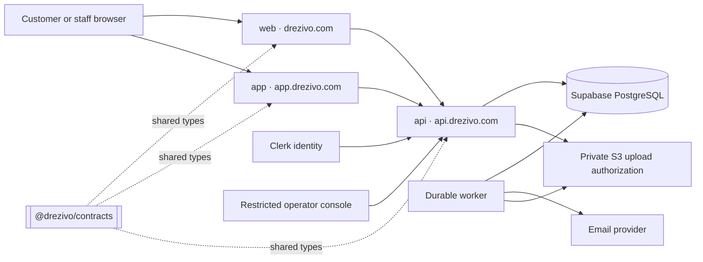

# Drezivo — Technical Requirements Document

**Revision:** 1.4 · **Date:** 26 September 2026
**Status:** Monorepo scaffold and architecture contract. Infrastructure remains unprovisioned; scaffold checks do not prove production performance, isolation or recovery.

**Changes in 1.2.** The five former checkouts are now workspaces in one root Git repository. The root lockfile, license, review boundary, and release evidence are authoritative. Workspace ownership remains explicit: `contracts` provides shared schemas, `api` owns business transactions and the worker, `app` and `web` render user journeys, and `docs` owns specifications. The former polyrepo decision remains as a superseded ADR. Automatic CI is deferred until the scaffold gate is green, as recorded in `docs/runbooks/ci-baseline.md`. Security controls, tenant context, and migration windows now apply across workspaces in one pull request.

**Changes in 1.3.** The V1.1 fitting backend boundary is frozen: staff-created fittings first; branch-scoped hidden capacity slots; 30-minute scheduling grid with one strict branch duration; hard hours/closure enforcement; canonical appointment state machine; atomic creation/reschedule; immediate guaranteed-garment allocation; branch-scoped optional fixed fee using the existing finance domain; Owner-only fitting configuration; existing audit/idempotency/outbox conventions; and staged cross-product rollout. Rooms/staff/named fitting resources and customer-facing reminders are not part of the first production fitting slice.

**Changes in 1.4.** Supabase replaces Neon as the managed PostgreSQL provider. The API continues to use Drizzle and `node-postgres` with restricted runtime roles, reviewed SQL migrations, transaction-local tenant context, and S3/MinIO for objects. Supabase Auth, Storage, Realtime, and Data API are not application dependencies. See `docs/decisions/0009-supabase-managed-postgresql.md`.

Read with [PRD](../product/Drezivo-PRD.md), [market research](../product/Drezivo-Market-Research.md), and [logical data model](Drezivo-Data-Model.md). Product release V1 is distinct from document revision numbers. The DBML describes relationships; SQL migrations must implement constraints it cannot express.

## 1. Architecture decision

Retain the team's familiar stack. Use a **modular monolith**: one Express business API, divided internally by domain, with a separately running durable worker using the same domain services. Two Next.js workspaces render the surfaces: `web` for marketing/storefront and `app` for staff. PostgreSQL is the source of truth for reservations, availability, money records, and workflow state.

| Component           | Selection                                                                         | Responsibility and tradeoff                                                                                                                                                                                                                                                     |
| ------------------- | --------------------------------------------------------------------------------- | ------------------------------------------------------------------------------------------------------------------------------------------------------------------------------------------------------------------------------------------------------------------------------- |
| Frontend            | Next.js + TypeScript, App Router                                                  | Server-render public catalogue; interactive booking/calendar. Do not duplicate business writes in Next.js route handlers.                                                                                                                                                       |
| Business API        | Express + TypeScript on a supported Node LTS                                      | REST JSON endpoints and transaction boundaries. Long-running containers suit explicit database transactions and predictable worker operation.                                                                                                                                   |
| Database            | Supabase PostgreSQL                                                               | Managed PostgreSQL only: shared schema with tenant keys, constraints, row-level security, and transaction locks. Separate staging and production projects; Data API disabled.                                                                                                   |
| Authentication      | Clerk                                                                             | Staff authentication and organization identity. Drezivo owns domain permissions, branch grants and subscription entitlements.                                                                                                                                                   |
| Files               | Private S3 buckets; separate public catalogue derivatives                         | Original evidence is private; controlled upload, quarantine, short-lived downloads.                                                                                                                                                                                             |
| Query/migrations    | **Decided: Drizzle + node-postgres (`pg`)**                                       | Confirmed 15 September 2026. TypeScript queries with reviewed SQL migrations for exclusion constraints/RLS. See `docs/decisions/0002-drizzle-and-node-postgres.md`. Custom SQL and real transaction tests remain mandatory.                                                     |
| Boundary validation | **Decided: Zod + OpenAPI 3.1, published as `@drezivo/contracts`**                 | Runtime input validation and one shared client shape. TypeScript alone cannot validate HTTP input. Because all surfaces share one monorepo (§2.1), the contract is a workspace package imported by every consumer; generated OpenAPI remains the external compatibility record. |
| Durable work        | Postgres outbox/job tables and polling worker                                     | Avoid an additional queue service initially; add SQS when measured load or operational needs justify it.                                                                                                                                                                        |
| Email               | Recommend an SES adapter, subject to deliverability pilot                         | Sender verification, bounce/complaint handling, queued sends. Provider-specific details stay behind an adapter.                                                                                                                                                                 |
| Observability       | Structured redacted logs, OpenTelemetry-compatible traces, error monitoring       | Correlate requests and jobs without recording request bodies or private evidence. Choose a hosted sink before pilot.                                                                                                                                                            |
| Tests               | Unit tests, HTTP integration tests against real Postgres, browser E2E, load tests | Suggested tools: Vitest, Supertest, Playwright, k6. Pin compatible releases during implementation.                                                                                                                                                                              |

Drizzle supports custom SQL migrations; that is relevant because an ORM schema is insufficient for the required PostgreSQL constraints. [Drizzle custom migrations](https://orm.drizzle.team/docs/kit-custom-migrations).

### Deployment recommendation

Each deployable workspace (§2.1) is one release boundary. The `api` repository produces **two** artifacts from one image — the HTTP server and the durable worker — because they share domain services and must not drift apart.

| Repository  | Artifact       | Host                   | Address                                                     |
| ----------- | -------------- | ---------------------- | ----------------------------------------------------------- |
| `web`       | Next.js server | Managed Next.js host   | `drezivo.com`; tenant storefronts at `drezivo.com/s/<slug>` |
| `app`       | Next.js server | Managed Next.js host   | `app.drezivo.com`                                           |
| `api`       | Express server | Managed container host | `api.drezivo.com`                                           |
| `api`       | Worker process | Managed container host | No public address; outbound only                            |
| `contracts` | npm package    | GitHub Packages        | `@drezivo/contracts`, consumed by the three above           |

All three browser-facing surfaces sit under one registrable parent domain. That is a deliberate isolation choice, not a cosmetic one: it lets the guest capability exchange in §3 set a host-scoped `__Host-` cookie, keeps the CORS allowlist an explicit three-entry list rather than a wildcard, and prevents a tenant slug from ever becoming a DNS-level identifier. **Tenant slugs are path segments under `/s/`, never subdomains.** A subdomain-per-tenant scheme would put tenant identity into the cookie origin, where a misconfiguration leaks one tenant's session to another; a path segment cannot.

For the first paid pilot, use a managed Next.js host (Vercel is a candidate), a managed container host for Express and the worker, Supabase PostgreSQL, and S3. Confirm region compatibility and prices before selecting paid plans. Prefer API, worker, database, and private storage in a nearby compatible region such as Singapore **if all chosen services support the required configuration**. Measure latency from Philippine mobile networks; geographical proximity is not a benchmark.

Use separate development, staging, and production secrets/accounts or projects, with least privilege. Do not use a free-tier suspension/retention assumption as a production recovery plan. Provide readiness checks, graceful shutdown and connection draining, dependency timeouts, and two API instances where required to meet the availability target. A single worker can restart safely because work and leases persist.

The browser never receives a database connection string or unrestricted S3 credentials. Next.js server rendering calls the API through scoped service/request adapters; it does not become a second source of financial or availability logic.

## 2. Domain boundaries and ownership

| Module             | Owns                                                                            | Key dependency                                             |
| ------------------ | ------------------------------------------------------------------------------- | ---------------------------------------------------------- |
| Tenancy/access     | Create-only owner onboarding, tenant bootstrap, local membership, branch grants | Clerk identity and narrowly reconciled organization events |
| Catalogue/assets   | Styles, variants, reusable measurement-guide references, physical assets, readiness | File metadata/accepted guide bytes and branch ownership  |
| Availability       | Authoritative planned asset intervals                                           | Reservations, maintenance; later fittings/transfers        |
| Reservations       | Quote snapshots, state transitions, pickup/return policy                        | Availability and operational finance                       |
| Finance            | Verified collections, charges, allocations, refunds, deposit liability          | Immutable sources and actor authorization                  |
| Storefront         | Published content, policies, public projections                                 | Catalogue, pricing, availability                           |
| Files              | Upload sessions, scanning, immutable accepted objects, retention                | S3                                                         |
| Platform billing   | Drezivo subscription and entitlements                                           | Separate operator/provider records                         |
| Notifications/jobs | Outbox, leases, reminders and delivery outcomes                                 | Domain events                                              |
| Operator/audit     | Support grants, incident actions, recovery records                              | Explicit privileged access                                 |

Modules call domain services, not another module's private database helpers. All mutations capable of changing capacity or money use a shared transaction context. Reporting reads cannot rewrite transactional facts.

Catalogue owns measurement-guide metadata and variant references; Files owns the accepted/frozen bytes. A staff Add Clothing command may accept shared color/pricing/timing plus selected sizes and expand them transactionally into variants and one initial physical asset per size. This V1 command convenience does not introduce a stock quantity column or prevent multiple assets from referencing one variant later. Asset quota checks run against the generated physical-asset count before commit.

### 2.1 Monorepo workspace topology

**Decided 16 September 2026: one Drezivo monorepo.** The root Git repository contains five
workspace boundaries. The former independent checkouts are retained as historical context only.
One root pull request can update a contract, API, client, and documentation together, while each
workspace still has a clear owner and deploy artifact.

| Workspace    | Owns                                                                            | Must never contain                                                      |
| ------------ | ------------------------------------------------------------------------------- | ----------------------------------------------------------------------- |
| `contracts/` | Zod schemas, OpenAPI, error envelopes, money and idempotency types              | Database access, provider credentials, or authorization decisions       |
| `api/`       | Domain modules, Clerk verification, authorization, database, migrations, worker | Presentation logic or duplicate contract types                          |
| `app/`       | Staff dashboard and authenticated workflows                                     | Direct database access, authoritative roles, or client money decisions  |
| `web/`       | Marketing, public storefront, and guest booking                                 | Staff-only data, private records, or server authorization logic         |
| `docs/`      | PRD, TRD, data model, ADRs, research, legal drafts, and runbooks                | Runtime business behavior and secrets                                   |

The root `package.json` declares these workspaces and the root `package-lock.json` is the only
install lockfile used for release. The dependency direction remains `contracts` → `api` →
`app`/`web`; the compiler can check all consumers in one change. The API and worker remain separate
process entry points from the same workspace and domain services.

Workspace `.claude` and `.codex` folders remain for local context and migration continuity. Root
agent rules and the root security baseline take precedence. Do not initialize another Git repository
below the root. Former Git metadata is preserved under the ignored `.polyrepo-git-archives/` folder
for reference only.

Breaking API changes still use an expand, migrate, contract window: keep old and new shapes valid,
migrate all workspace consumers, then remove the old shape in a later release. A workspace may be
deployed independently after its affected checks pass, but the root review gate must cover
the complete change before a release tag.

## 3. Authentication, authorization, and tenant isolation

### Staff request path

1. Verify Clerk JWT signature, issuer, expiry and supported audience/authorized-party configuration using the SDK. For REST, return JSON `401`, not a redirect to an HTML login page.
2. If the session has no active organization, list only provisioned workspaces where the Clerk
   subject has an active local membership. The workspace list is a narrow account-scoped read;
   it is not a global RLS bypass.
3. Map the token's active organization to the unique local tenant; resolve the local active
   membership, active branches, selected branch grant, subscription, and positive entitlements.
   Deny missing, suspended, unknown or mismatched context. Restricted and cancelled tenants
   resolve to the shared action-policy gate rather than being blanket-denied here.
4. Check the requested branch, record ownership and action. A branch ID from the browser is a selector, never permission.
5. Start a transaction using a checked-out connection. Set tenant/principal context transaction-locally; every query remains on that connection until commit/rollback.
6. Use explicit tenant predicates and same-tenant foreign keys as well as RLS. Give the runtime role no ownership, DDL, `BYPASSRLS`, or blanket administrative grant.

Clerk supplies identity and organization context, but Drezivo authorizes current local membership, role, branch grant, tenant lifecycle, and entitlement. The backend creates the Clerk organization for a verified owner candidate; a signed organization-created event may repair a missing incomplete record but never starts a tenant or trial. Drezivo accepts only organization, organization-invitation, and organization-membership events for reconciliation, never Clerk user-profile synchronization. An external Clerk organization deletion immediately restricts the mapped tenant and public intake while records remain available for operator recovery.

Clerk's docs warn that background requests in different organization tabs should use the appropriate token explicitly. Include a cross-tab organization-switch test. Clerk's Express authentication middleware recognizes credentials; the application must enforce API authorization. [Clerk Organizations](https://clerk.com/docs/guides/organizations/overview), [Clerk Express SDK](https://clerk.com/docs/reference/express/overview).

**Membership freshness:** use a signed, deduplicated webhook inbox to synchronize changes, plus periodic reconciliation. Sensitive actions (payment destination changes, support grants, role changes) require recent authentication and an up-to-date membership check. Access removal initiated in Drezivo first disables local membership, then queues the Clerk change. Out-of-order webhook events must not re-enable removed users. If fresh authorization cannot be established, deny the sensitive action and retry later.

RLS is defense against accidental query scope errors, not protection from a fully compromised API that can set its own tenant context. PostgreSQL owners and bypass roles can evade normal policies; test with the actual restricted runtime role and use explicit `WITH CHECK` policies. [PostgreSQL row security](https://www.postgresql.org/docs/current/ddl-rowsecurity.html).

### Tenant context across workspaces

Multi-tenancy is the property most easily broken by a workspace boundary, because a tenant identifier that travels between two code bases looks like ordinary data. It is not data; it is authority. The rules below make the boundary explicit.

**One resolver.** `api` is the only workspace that resolves tenant identity. It derives the tenant from the verified Clerk organization (staff) or from the published storefront slug (public), never from a body field, a query parameter or a header supplied by the browser. Staff workspace discovery is a separate account-scoped projection: `GET /api/v1/workspaces` uses a narrow SECURITY DEFINER resolver that accepts only the transaction-local Clerk principal and returns tenants where the actor has an active local membership. `GET /api/v1/actor-context` then enters normal tenant RLS and resolves membership, active branches, the selected branch grant, subscription and positive entitlements. The optional `X-Drezivo-Branch-Id` is a selector only; it never grants access.

The internal TBF-032 entitlement service owns plan resolution and quota enforcement for both actor
context and bootstrap. It accepts only the caller's existing database client, validates an active
version-1 plan and its required positive entitlements, and fails closed for missing, inactive,
unsupported, or malformed plan data. Physical-asset and Front Desk-seat guards lock the tenant
row before counting active usage and retain the lock through the caller's write. Front Desk
counts include active memberships plus unexpired pending invitation reservations; the Owner is
never counted as a Front Desk seat. Plan
and entitlement writes are migration/tooling operations, not runtime application writes.

**The contract enforces this.** `@drezivo/contracts` must not define `tenant_id`, `organization_id` or `branch_id` as an accepted field on any tenant-owned write. If the schema cannot express it, a frontend cannot send it and a reviewer cannot miss it. A branch identifier may appear as a **selector** on a request, and §3 step 3 still applies: it selects among branches the actor already has, and it never grants access to one they do not.

**The frontends hold no authority.** `app` and `web` may display an organization and a branch, and may hide controls the actor cannot use. That is presentation. Every one of those checks is repeated server-side, and a divergence between them is a UI bug, never a security boundary. `web` in particular renders only published projections: an unpublished or foreign store returns `notFound()`, matching the API's rule that a foreign object is a `404` and never a `403` that confirms it exists.

**Organization switching is explicit on the staff surface.** Clerk's own documentation warns that
background requests from a tab left open in another organization can carry the wrong token. The
`app` workspace switcher sets Clerk's active organization from the server projection, sends the
current token on each request, and discards in-flight queries on switch. `web` is public storefront
traffic and does not carry a staff organization context. The cross-tab organization-switch test
belongs in the root gate when automatic CI is enabled.

**The worker carries tenant context per job, not per process.** The worker runs outside any HTTP request, so nothing sets its tenant context for it. Every outbox and job row stores the owning `tenant_id`; the worker sets the context transaction-locally for each claimed job and fails the job closed if the row has no resolvable tenant. A worker process must never hold a long-lived session-level tenant setting — a leaked setting across jobs is a cross-tenant write.

**`SET LOCAL`, never `SET`.** Supabase transaction pooling does not preserve session state across transactions, and session-scoped state is unsafe under any shared pool. Tenant context is therefore set transaction-locally, inside the same transaction as the queries it governs, on the same checked-out connection, and released by commit or rollback. Any code path that opens a connection without establishing tenant context must be unable to read tenant-owned tables at all; that is what `FORCE ROW LEVEL SECURITY` and the absence of `BYPASSRLS` on the runtime role are for.

**Test the boundary in `api`, because nowhere else can.** The required adversarial tests in §11 include a cross-tenant read attempt, a cross-tenant write attempt, and a job whose tenant context was not set — each asserting failure against the real restricted role on real PostgreSQL. No frontend test and no contract test can prove tenant isolation; only these can.

### Guest access

Browsing a published tenant catalogue is intentionally public. Other guest actions require a server-issued scoped capability. At hold creation generate a cryptographically random secret, store only its hash, and scope it to one tenant/reservation and permitted actions with expiry/revocation. Use a capability exchange to an HttpOnly secure session where possible. Keep bearer links out of logs, third-party analytics, referrers and shared caches. Reference numbers and email addresses are not authentication.

Require email/contact verification and abuse controls appropriate to pilot results; a resend endpoint always returns a generic answer and rate-limits by destination and source. A leaked booking capability must not reveal other bookings, full identity documents, or payment configuration.

### Platform support

Separate operator identity and routes from tenant accounts. Time-limited, reason-coded support grants scope access to one tenant; private evidence access needs a separate permission. Audit grant issuance, use and revocation. No default impersonation or unrestricted customer-record browsing. Operator emergency access must be documented and reviewed.

## 4. API contract

Use `/api/v1` for the first API major version. Product V2 branches do not require `/api/v2` unless the contract breaks. Define OpenAPI before frontend integration.

**The contract is owned by the `contracts/` workspace (§2.1), not by `api/`.** Two version numbers exist and they mean different things: `/api/v1` is the wire-level major version and changes only when the contract breaks incompatibly; `@drezivo/contracts@x.y.z` is the package version and moves on every additive change, so a consumer can state exactly which shapes it was built against. `api` implements the contract and does not define it; `app` and `web` consume it and define nothing. The OpenAPI document is generated from the Zod schemas and committed, and CI fails if regenerating it produces a diff — a stale committed document would otherwise describe an API that no longer exists. Restrict content types, body size, pagination and filters; reject unknown enum values and disallowed fields. Use opaque IDs and ISO timestamps. Serialize monetary minor units as decimal strings so JavaScript number limits cannot silently corrupt amounts.

| Endpoint family                      | Representative operation       | Authority / duplicate protection                                                |
| ------------------------------------ | ------------------------------ | ------------------------------------------------------------------------------- |
| `/public/stores/{slug}`              | GET catalogue/policies         | Published projection, bounded public response                                   |
| `/public/stores/{slug}/availability` | GET variant/date availability  | No customer details; short-lived answer, never a guarantee                      |
| `/public/stores/{slug}/holds`        | POST checkout intent           | Rate-limited anonymous checkout identity + idempotency; database capacity claim |
| `/guest/reservations/{id}/receipts`  | POST evidence attachment       | Scoped capability; immutable uploaded object; idempotency                       |
| `/guest/reservations/{id}`           | GET own summary                | Scoped capability, `no-store`                                                   |
| `/reservations/availability-calendar` | GET staff variant/day preview | Membership + reservation permission; branch-local bounded advisory projection, never a guarantee |
| `/reservations/availability-check`   | GET staff exact-time preview  | Membership + reservation permission; exact buffered interval and server pricing, still non-binding |
| `/reservations`                      | POST staff/walk-in request     | Membership; same quote/hold logic as storefront                                 |
| `/reservations/{id}/confirm`         | POST merchant confirmation     | Financial capability, state/version checks, idempotency                         |
| `/reservations/{id}/reschedule`      | POST new interval              | Capability, fresh quote, atomic allocation replacement                          |
| `/reservations/{id}/pickup`          | POST physical handover         | Capability, current custody/readiness, conditional transition                   |
| `/reservations/{id}/return`          | POST actual return             | Capability, duplicate-safe custody event and inspection workflow                |
| `/refunds`                           | POST refund instruction/record | Owner capability, locked residual amount, immutable reversal record             |
| `/uploads`                           | POST upload authorization      | Tenant/capability scope, size/type budget and idempotency                       |
| `/onboarding`                        | POST owner organization start  | Verified Clerk user; API-created organization; account-scoped idempotency       |
| `/onboarding/current`                | GET owner onboarding state     | Safe pre-tenant projection; account scope; rate limited                         |
| `/onboarding/{onboardingId}/abandon` | POST abandon owner setup       | Account scope; conditional transition; account-scoped idempotency               |
| `/exports`                           | POST export job                | Authorized scope, durable job and expiring download                             |
| `/webhooks/{provider}`               | POST provider event            | Exact raw bytes, signature verification, replay checks and event inbox          |

Every implemented route needs a permission policy even when public access is the intended policy. Preserve exact webhook bytes before JSON parsing. Use provider-supported signature algorithms, replay windows and constant-time secret comparison where applicable.

Errors use a stable envelope: `code`, safe `message`, `request_id`, optional field errors. Use `401` unauthenticated, `403` unauthorized, `404` for concealed foreign objects, `409` capacity/state/idempotency conflict, `422` invalid inputs, `429` throttled, `503` unavailable dependency. Never return raw SQL errors or foreign-key information that identifies another tenant.

### Idempotency contract

Every mutating UI disables the control, displays pending status, and has a handler early-return guard. Generate one key per user intent; reuse it across network retries. A new edited intent receives a new key.

On the server, scope a unique idempotency record by tenant, stable authenticated or checkout principal, operation, and key. Store a canonical validated request hash. Same key/different hash returns `409`; a concurrent matching request waits briefly or returns an in-progress response with retry guidance. Commit the domain change, outcome and outbox rows atomically. Do not recover from a uniqueness failure inside an already aborted Postgres transaction; roll back and fetch the winner safely.

Retain records for a documented retry window (proposed seven days for general mutations). Permanent business keys and conditional transitions still protect financial postings and provider events after API idempotency records expire. Do not cache raw private data in an unencrypted idempotency response blob.

## 5. Booking and availability transaction contract

### Time and prices

Persist UTC instants with the booking's IANA timezone snapshot. Customer/staff date selection resolves to explicit local pickup and return deadlines. Validate time ordering and policy bounds on the server. For staff intake, clothing and variant selection precede date selection; a bounded inline calendar may project branch-local day availability from the selected variant's active/ready serialized assets, but that projection is advisory because actual capacity depends on exact timestamps and one physical asset covering the entire interval. After pickup/return times are selected, a non-mutating exact preview recomputes the buffered interval and eligible asset count; reservation creation still locks/revalidates before claiming one asset. Store the resulting price/policy snapshot; editing a catalogue price never rewrites an accepted rental.

A `fixed_duration` tariff treats `included_duration_minutes` as both the base-price duration and the minimum elapsed rental duration. A request shorter than that minimum fails server-side. Longer intervals retain the existing extra-day pricing rule, including rounding a partial extra day upward. `daily` pricing does not inherit that fixed-duration minimum. Optional `event_date` must fall inclusively between the branch-local pickup and return calendar dates; frontend bounds are convenience only and the API repeats the rule.

Use `[blocked_start, blocked_end)` where `blocked_start = pickup_at` and `blocked_end = due_at + recovery_duration`. V1 has no pre-pickup preparation buffer. Example: pickup 10:00 Friday, due 10:00 Monday, and 24 hours of recovery blocks Friday 10:00 through Tuesday 10:00. An adjacent allocation starting Tuesday 10:00 can be accepted if other readiness constraints allow it. Recovery is the single owner-configured post-return operational buffer for cleaning, inspection, transport, or preparation for the next rental. Charging duration is separate from occupied duration; display both clearly.

### Hold transaction

1. Validate published storefront, active tenant entitlement, branch, dates and input. Compute price and due-now amount; ignore client-sent totals.
2. Lock candidate physical assets in deterministic ID order. All code paths that change their allocation/readiness use that lock order.
3. Transition expired blocking holds under lock, using database time. Deny archived/unready assets for the requested fulfillment conditions.
4. Insert the reservation, price/policy snapshots and one blocking allocation per selected physical asset. A PostgreSQL GiST exclusion constraint rejects overlapping blocking periods.
5. Commit the guest capability hash, idempotency outcome and relevant outbox records. Only now return payment instructions and the 15-minute expiry.

The scheduled expiry worker is cleanup; correctness must not depend on it running on time. An availability response can lag; a hold cannot bypass the database constraint. Exclusion predicates use stored deterministic values such as `is_blocking`, not `now()`.

PostgreSQL supports range overlap exclusion, and Supabase provides `btree_gist`, which allows scalar IDs to participate in the same GiST constraint. These are capabilities to use, not evidence that the model has been tested on a deployed Supabase project. [PostgreSQL ranges](https://www.postgresql.org/docs/current/rangetypes.html), [Supabase extensions](https://supabase.com/docs/guides/database/extensions).

### Receipt and confirmation

Receipt submission must finish before the original 15-minute hold expires, attach an accepted immutable object, and convert the same allocation to `pending_confirmation`. The review deadline may extend toward pickup but must never shorten the original 15-minute hold and must remain no later than 24 hours from initial acquisition. Never extend repeatedly without bound. Warn the merchant before expiry. If the shop is closed, show that fact and the fixed deadline before the renter sends money.

Merchant approval locks reservation, payment intent and assets, verifies the review deadline and current eligibility, records the actual merchant-account verification, posts verified money, and transitions the same allocation to confirmed. A screenshot alone is insufficient. Repeated approval returns the original outcome. Cash collection records amount, actor, time and purpose through the same posting layer; permission to record cash is explicit.

An expired hold does not reverse a bank transfer. Late evidence or a settled transfer enters a payment exception queue. Record genuine received money even when inventory cannot be confirmed; resolve through a refund or a newly quoted, freshly allocated booking. Never create a confirmed booking solely because funds arrived.

### Reschedule, cancellation and return

- Reschedule locks old/new assets and the reservation. Acquire the new valid allocation and update snapshots within one transaction. If the new interval fails, roll back completely and retain the old booking. Obtain customer acceptance for repricing/policy changes.
- Cancellation atomically releases eligible future allocation and creates any financial obligation; an external refund remains pending until verified. A picked-up rental cannot be cancelled into “available.”
- Record actual pickup/return as immutable custody facts with a conditional current-state update. A late return cannot fail because it intersects a future planned interval. Mark affected bookings disrupted, deny handover of the missing/unready asset, and offer alternatives/refund handling.
- Return does not mean ready. Inspect, settle approved adjustments, clean, then mark ready. Extension requests must recheck future capacity; actual overrun still needs recording if extension is denied.

## 6. Operational finance

This is a rental subledger, not a certified accounting system. Distinguish rental charges, advance payments allocated toward charges, security-deposit liabilities, approved damage/late fees, refunds, and write-offs/reversals. Display cash collected separately from rental revenue and money held as deposit. Do not claim tax-compliant invoicing before jurisdictional review.

Use signed/typed immutable entries or explicit related posting tables with permanent source keys. Store corrections as reversals linked to the original entry; a hash alone does not enforce immutability. Enforce currency equality, positive bounded amounts, allocated amount ≤ available verified payment, and total refunded/released ≤ the applicable refundable balance. Lock the payment/deposit account before summing and posting. The database runtime role must not update/delete posted financial facts.

Example: PHP 3,000 rental plus PHP 2,000 refundable security; due now PHP 1,000 rental advance. A verified PHP 1,000 leaves PHP 2,000 rental balance and PHP 2,000 security due. Collecting all PHP 5,000 does not make rental revenue PHP 5,000. Returning PHP 2,000 security reduces the liability and cash, not the original rental charge.

A manual refund is an instruction plus a verified completion record. Double-clicking cannot create another instruction. If payment confirmation is uncertain after an external timeout, reconcile the provider/merchant reference before retrying the external transfer. Drezivo does not execute merchant-bank refunds in V1.

Drezivo subscription billing has separate entities, references and reports. The owner-confirmed monthly PHP plan prices are Starter 300, Professional 499, Business 1,299 (minor units 30000, 49900, 129900). Version prices and entitlements; do not read outdated screenshot values. Tenant cancellation/downgrade does not erase financial history. During billing restriction, disable new booking intake but keep authorized returns, dispute handling, refunds and export available for existing commitments.

The first successful tenant bootstrap starts the selected plan's fourteen-day trial from database time. Trial eligibility is one lifetime trial per verified person, not one per tenant. Starter, Professional, and Business enforce 125 / 300 / 1,000 active physical assets and 0 / 2 / 10 Front Desk seats immediately, including during trial; seats count active Front Desk memberships plus unexpired pending invitations. Trial expiry enters a seven-day normal-access `past_due` grace, then `restricted`. Restriction permits only approved existing-rental settlement, returns, refunds, and exports through one shared policy gate. `cancelled` is the persisted tenant closure status and retains read-only settlement/export access. A later business remains pre-tenant `payment_pending` until an operator records verified manual payment. Store transitions in immutable subscription history and process expiry through durable jobs plus request-time checks. During the trial, only the Owner may change the plan through `POST /api/v1/subscription/plan`; the shared entitlement service validates the target plan and rejects downgrades that cannot fit current active assets or Front Desk seats. Paid-plan changes remain deferred to later operator/payment work. V1 has no card collection or recurring billing provider.

## 7. Files and privacy

Authorize upload purpose, expected size, content types and owner before signing. Use unpredictable immutable keys; accept catalogue images and evidence through separate policies. Limit image dimensions/decompression, strip unnecessary metadata, validate actual file signatures, and scan quarantined objects. Never execute uploaded content.

S3 presigned URLs can be reused until expiry and can overwrite an existing key. Therefore a successful upload is not automatically immutable: finalize against an exact object version/checksum, or copy the accepted version to an inaccessible final key before marking it available. A later reuse of the upload URL must not change the evidence a merchant approved. [AWS presigned URL documentation](https://docs.aws.amazon.com/AmazonS3/latest/userguide/using-presigned-url.html).

Catalogue products allow at most five ordered photos per style, with display order zero as the cover. Each source image remains limited to 10 MB and each proof image to 5 MB. Serve optimized public derivatives only. Keep private evidence access short-lived (proposed five-minute downloads), no public ACLs, no indexing, no shared CDN cache. Use IAM roles, encryption at rest and TLS. Keep object versions in the retention/deletion inventory.

Store minimum contact data. Identity evidence is opt-in by justified merchant policy, not a default checkout requirement. Define retention by purpose, legal obligation and dispute needs before launch; do not invent a universal statutory retention period. Erasure jobs must cover originals, derivatives, object versions and exports, while respecting documented legal holds. Restoring backups requires reapplying the deletion/hold register before customer access resumes.

## 8. Jobs, notifications, and integration safety

Write outbox events in the same transaction as the business event. Workers claim due rows using a row lock/`SKIP LOCKED`, persist a lease token and deadline, then process outside that short claim transaction. Complete only if the lease token still matches. A crashed worker's lease can expire and be reclaimed.

Persist attempts, next-attempt time, provider reference, last safe error, and terminal status. Use exponential backoff with jitter and a finite maximum (proposed eight attempts); alert on terminal failures. A job's stable deduplication key survives retries. Polling, not session `LISTEN`, is the initial design.

Exactly-once email delivery cannot be promised with an external provider. Use provider idempotency where supported; otherwise duplicate-safe message content and delivery reconciliation. Never couple reservation success to email success. UI states distinguish queued, provider-accepted, delivered where known, bounced and failed. Reminders recheck the reservation version before sending so a reschedule does not send obsolete pickup details.

Webhook endpoints verify signatures over raw bytes and insert unique provider event IDs before processing. A duplicate event returns success without another effect. Events received out of order are reconciled to authoritative provider state or rejected from an invalid transition. Do not rely on arrival order.

## 9. Supabase PostgreSQL operations and schema evolution

Use bounded application pools and short interactive transactions. Persistent API and worker processes use Supabase's direct endpoint when their network supports it, otherwise the shared session pooler. Serverless deployments may use transaction pooling only after disabling incompatible prepared/session behavior and reducing each warm instance's application pool deliberately. Apply tenant context transaction-locally on the same connection and test connection reuse across tenants. Use the direct connection for migrations, backup, restore, and other administrative tools. Pooler client capacity is not a requests-per-second or workload guarantee. [Supabase connections](https://supabase.com/docs/guides/database/connecting-to-postgres), [pooling and limits](https://supabase.com/docs/guides/database/connecting-to-postgres/pooling-and-limits).

Apply version-controlled, reviewed migrations once through CI/CD using a migration role over `DATABASE_URL_DIRECT`. Never run schema synchronization on each API startup. Test raw constraints and RLS on the selected supported PostgreSQL major and Supabase connection mode. Pin that version; schedule upgrades and rehearse them. Runtime traffic connects through separate `drezivo_app` and `drezivo_worker` credentials, never through the migration role.

For rolling changes use expand/backfill/validate/switch/contract. Add nullable fields, backfill in bounded batches with progress, validate invariants, then enforce non-null/unique constraints. Keep old/new application compatibility through deployment. Large indexes and constraint changes require lock budgets and appropriate migration options. Roll forward data fixes; do not assume an application rollback reverses a data migration safely.

Use a separate Supabase staging project for migration and deployment rehearsal. Preview branches may be added later, but they do not replace staging or an independent recovery plan. Prefer synthetic or anonymized seeds and forbid arbitrary preview access to live personal data. Confirm the purchased backup retention and point-in-time recovery configuration, then rehearse restores. Supabase notes that custom-role passwords may need to be reset after restore. [Supabase deployment environments](https://supabase.com/docs/guides/deployment), [Supabase backups](https://supabase.com/docs/guides/platform/backups).

The Supabase Data API remains disabled. Drezivo clients authenticate with Clerk and call the Express API; Drezivo RLS policies depend on transaction-local `app.tenant_id`, `app.principal_id`, and `app.actor_kind`, not Supabase Auth claims. Audit default privileges for `anon`, `authenticated`, and `service_role` before loading business data. [Supabase Data API security](https://supabase.com/docs/guides/api/securing-your-api).

### Scaling triggers

Start with indexed tenant queries, bounded calendar windows, keyset pagination and optimized images. Cache public catalogue data by tenant/content version; keep guest/private responses uncached. Availability writes and final checks always use the writer database.

Measure before adding read replicas, Redis, partitions or services. Candidate triggers: sustained database CPU/queueing during a representative peak, reports consuming a material fraction of the transaction budget, or one tenant dominating capacity. Move reports to asynchronous projections first. Retain a path to dedicated tenant storage for contractual needs, using internal tenant IDs rather than Clerk IDs as physical keys; do not promise automated tenant sharding in V1.

## 10. Release evolution

| Release | Technical increment                                                                                             | Migration / operational gate                                                                                                 |
| ------- | --------------------------------------------------------------------------------------------------------------- | ---------------------------------------------------------------------------------------------------------------------------- |
| V1      | Shared tenant schema, default branch, physical assets, guarded single-garment checkout, basic staff permissions | Isolation, duplicate safety, capacity and restore tests; pilot outcome gate                                                  |
| V1.1    | Multi-line interface and fitting appointments with hidden branch capacity slots                                  | Atomic capacity/garment claims, state/timing guards, branch schedule integrity and garment availability                       |
| V2      | Branch transfers and permissions                                                                                | Backfill default ownership; transfer dispatch/receive, in-transit state, delayed/lost transfer and unauthorized branch tests |
| V3      | Enterprise governance, negotiated SSO/integrations, possible dedicated isolation                                | Documented customer need, threat review, recovery drills, operational staffing and cost model                                |

V1.1 fittings use hidden branch capacity slots, not room/staff/named-resource assignment. A branch configures maximum simultaneous fittings; capacity `N` is represented by `N` internal slots. Each pending/confirmed appointment claims exactly one slot for its bounded appointment period. Slot overlap is protected by a PostgreSQL exclusion constraint, and booking/configuration mutation is serialized against the branch fitting-settings row so correctness never depends on an unguarded `count then insert`.

The branch also owns `fittings_enabled`, one strict fitting duration, an optional fixed fitting fee, weekly operating windows and date-specific closures. Start times align to 30-minute boundaries; duration is at least 30 minutes and a multiple of 30. A fitting must fit fully inside one operating window and outside closures. Gaps between weekly windows represent recurring breaks. Branch timezone is authoritative and is snapshotted on the appointment. Capacity/hour/closure changes that would invalidate existing future fittings reject; duration/fee changes affect only new appointments.

Canonical states are `pending`, `confirmed`, `completed`, `rejected`, `cancelled`, `no_show`. Create always produces `pending`; allowed transitions are `pending -> confirmed|rejected|cancelled` and `confirmed -> completed|cancelled|no_show`. Terminal states never reopen. Reject/cancel require an internal reason. No automatic clock-based state changes occur. Once start time is reached, reschedule, garment-plan edits, reject and normal cancel are frozen; no-show is allowed after start and complete only at/after end.

Creation is one transaction: validate branch settings/hours/closure, claim one hidden capacity slot, deterministically claim every guaranteed physical garment, create fitting/lines, create a `fitting_fee` charge when fee is positive, write audit metadata and approved outbox intent, then commit. Preference-only lines carry no asset assignment. Guaranteed lines must carry one real eligible asset and an `asset_allocation` covering exactly the fitting period. Failure at any required step rolls back the entire create.

Reschedule is a dedicated command, not a generic period edit. It validates and obtains replacement capacity and guaranteed-garment claims before old claims are released; failure preserves the original appointment. Future pending/confirmed garment-plan changes use the same atomic replacement rule. Rejected/cancelled appointments release capacity/garments immediately; no-show may release after start; completed may release only at/after end.

Every production fitting links to a real customer. Staff-created walk-ins require full name plus phone or email. Duplicate matching is advisory only; no auto-merge/reuse by contact alone. Owner and Front Desk may perform operational fitting commands, while only Owner mutates fitting configuration. A fitting may carry one bounded internal staff note. Normal staff operations never hard-delete fittings; meaningful mutations write the existing append-only audit log.

A positive branch fitting fee snapshots onto the appointment and creates an immutable `fitting_fee` charge. Payment/evidence lifecycle remains independent and never gates confirmation. Cancellation/rejection/no-show do not automatically refund; finance corrections remain explicit. The first fitting backend slice is staff-only and sends no customer-facing fitting notifications or reminders, though services remain safe to connect to the existing outbox later. Cross-product adoption is staged: `/fittings` and `/fittings/schedule`, then Calendar, Dashboard, Availability and Payments.

V2 transfers track request, approval where needed, dispatch, transit, partial receipt and completion. An asset is not at the destination merely because a transfer was requested. Future promises must respect transfer lead time and delays. Changing branch ownership cannot retroactively move historical revenue/custody. Separate legal businesses/franchisees remain separate tenants unless an explicit governed group model is designed.

## 11. Reliability targets and falsification

The following are **proposed launch gates**, not measured results or contractual SLAs:

| Measure             | Target and test boundary                                                                                                                                          |
| ------------------- | ----------------------------------------------------------------------------------------------------------------------------------------------------------------- |
| Availability        | 99.9% successful eligible API operations monthly, including dependency-induced failures; planned maintenance counted                                              |
| API latency         | p95 availability ≤500 ms, p95 ordinary mutations ≤1 s; exclude binary upload/provider email time and measure those separately                                     |
| Representative load | 100 seeded tenants, 1,000 physical assets in the busiest tenant, 50 requests/s including 5 mutations/s for 30 minutes; add same-asset contention tests separately |
| Mobile UX           | Core pages and checkout usable at 360 px; target p75 LCP ≤2.5 s under documented mobile test conditions                                                           |
| Accessibility       | WCAG 2.2 AA target for core flows; keyboard, labels, focus, errors and non-color status checks                                                                    |
| Hold cleanup        | p95 expired hold release ≤60 s; transactional expiry checks preserve capacity correctness during worker outages                                                   |
| Recovery            | Proposed RPO ≤15 min, RTO ≤4 h for a defined recoverable database incident, only after purchased-plan verification and drill                                      |
| Integrity           | Zero duplicate postings/overlapping blocking allocations in acceptance suite; no percentage allowance for financial duplication                                   |

Recovery scope includes database, object manifest, application configuration and identity mappings. Use configured point-in-time recovery plus independent encrypted exports/backups as appropriate; test object restoration and deletion replay. Backups must never be treated as verified until restored and reconciled. A whole-provider regional outage requires a separate continuity analysis; the proposed incident target does not prove multi-region failover.

### Required adversarial tests

1. Two browsers request the last garment at once; exactly one blocking allocation succeeds. Repeat with different idempotency keys, retries and stale catalogue cache.
2. Submit/approve/reject/expire the same hold concurrently; one legal result, one posting and one event per permanent business key.
3. Worker stops for an hour; holds are still safely reclaimed by transactions, notifications remain queued, and replay does not duplicate financial effects.
4. Reschedule into an occupied interval; original confirmed allocation and accepted price remain intact.
5. Return is late across the next booking; actual return records successfully, next handover is denied until ready, impacted customer workflow is visible.
6. Two concurrent refunds or deposit releases exceed the remaining balance together; at most the permitted sum posts.
7. Tenant A sends tenant B's branch/asset/file/payment IDs through every route, job and export; no data disclosure or mutation. Repeat pooled connection reuse after rollback.
8. Reuse an upload URL after evidence approval; accepted evidence bytes do not change. Attempt oversized/deceptive content and foreign file attachment.
9. Remove a staff member, then replay stale JWTs and delayed webhooks; sensitive access stays denied.
10. Restore to a point before a completed external payment; reconcile references and disable automatic outbound side effects until duplicates are ruled out.
11. Suspend a subscription mid-rental; no new checkout succeeds, but authorized return/refund/export still works.
12. Test DST changes for a future non-Manila tenant, exact adjacent intervals, midnight returns and invalid time ranges.
13. Run a worker job whose row carries no resolvable tenant, and a job that follows a job for a different tenant on the same pooled connection; the first fails closed, the second reads nothing belonging to its predecessor. No session-level tenant setting survives either.
14. Race fitting creates/reschedules at the last hidden branch-capacity slot and last eligible guaranteed garment; capacity and asset exclusion each produce one valid winner, and failed replacement leaves the original fitting intact.
15. Race a fitting capacity/hour/closure configuration mutation against a new booking under the same branch fitting-settings serialization boundary; the result is either the old configuration plus accepted booking or the new valid configuration, never an accepted booking that violates the committed configuration.
16. Exercise fitting timing/state guards: no 15/45-minute start boundary, no non-30-multiple duration, no schedule override, no reject/cancel/reschedule/garment edit after start, no complete before end, no no-show before start, and no automatic state transition merely because time passed.
14. Point a consumer pinned to the previous `@drezivo/contracts` version at the current API during a migration window; both the old and the new shape are accepted and produce identical domain effects. Then remove the old shape and confirm the stale consumer fails loudly at the boundary with the standard error envelope, not with a silent `undefined` reaching the interface.

For V2 add opposing branch transfers, duplicate dispatch/receipt, partial arrival, lost items and revoked branch permissions. Tests run against PostgreSQL, not SQLite or mocked locking. Load tests report environment, dataset, error mix and raw percentiles. No test suite exists yet; these are implementation acceptance requirements.

## 12. Operational readiness and remaining decisions

Before paid launch: name an incident owner and backup; establish alert routing, support hours, deploy rollback procedure, restore procedure, privacy-request handling, and merchant payment-exception playbook. Track latency, transaction conflicts, database pool wait, expired holds, outbox lag, failed scans, email bounces and unreconciled money without logging personal content.

Remaining selections: hosting plans/region; email sender and quotas; observability service; subscription collection provider; justified retention schedule; merchant financial/legal templates. Defer renter gateway selection until provider onboarding, Philippine coverage, settlement, refund and webhook behavior have been verified. Keep adapters so those decisions do not change core booking and money invariants.

## 13. Monorepo operations and scaffold boundary

The root Git repository is the only source of version history, review, licensing, and release
evidence. `contracts`, `api`, `app`, `web`, and `docs` are workspace boundaries, not separate
repositories. The API remains the authority for authentication context, tenant scope, transactions,
migrations, and the durable worker. The clients remain consumers, and the docs workspace remains
the narrative authority.

Automatic CI is planned after the scaffold gate is green. A change that crosses a workspace boundary
updates the relevant contract, API, client,
test, and docs files in one pull request whenever compatibility permits. Use exact workspace imports
for `@drezivo/contracts`, never a copied type. Keep old and new contract shapes valid through an
expand, migrate, contract window.

Tenant resolution comes from verified staff organization or a validated published storefront slug.
Never trust a browser-sent tenant ID. Public DTOs exclude internal fields. Unknown or unimplemented
operations fail closed; placeholder screens and health responses are not implemented workflows.

V1 authentication must validate a server-side session or verified provider equivalent for absolute
expiry, idle timeout, revocation, current user state, and a concurrency-safe session cap. Guest
capability cookies are host-only, Secure in production, and HttpOnly. Cross-origin REST access uses
an explicit origin allowlist. See the private root `SECURITY-FOUNDATION.md` for the threat model and launch
gates.

Commit policy: short-lived `<type>/<slug>` branches, Conventional Commits, reviewable pull
requests, and squash merge after checks. No direct main push. Root `.github/` owns CI, CODEOWNERS,
security automation, and templates. Repository-local Git metadata is archived and must not be used.
No migration is applied by this task. Transactional booking/payment implementation, actual provider
configuration, tenant-isolation integration tests, restore drills, and GitHub branch protection
remain explicit delivery work.
