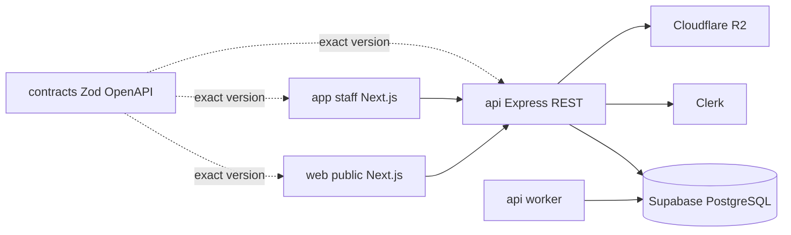

# Drezivo Architecture

The API is the authority for authorization, tenant scope, money, availability, and state
transitions. The browser is a client, never a trust boundary. The [TRD](../../architecture/Drezivo-TRD.md)
and [data model](../../architecture/Drezivo-Data-Model.md) contain the complete technical contract.

Customer address and optional social-profile handling follows the tenant-scoped, API-owned
boundary described in [[02-Architecture/Customer Address and Social Profile Fields]].

Supabase supplies managed PostgreSQL only. Clerk remains the identity provider. Production object
storage targets Cloudflare R2 while local development keeps MinIO through the same S3-compatible
`ObjectStorage` boundary. Browser clients never use Supabase database or object-storage credentials.
The API and worker connect as separate restricted roles; migration tooling uses the direct
administrative connection. See [[Supabase Managed PostgreSQL]].

The backend follows explicit feature boundaries between routes, controllers, services,
repositories, DTOs, and schemas. See [[02-Architecture/API Module Boundaries and Layering]] for
the accepted cleanup policy and infrastructure-module exception.

The staff Calendar's Clothing Availability tab is documented in
[[02-Architecture/Clothing Availability Timeline - Backend]]. It is a bounded asset-lane
projection: Reserved and Rented are continuous reservation bars with Pickup/Return boundary labels,
while all readiness and planned operational blocks render as Unavailable.
